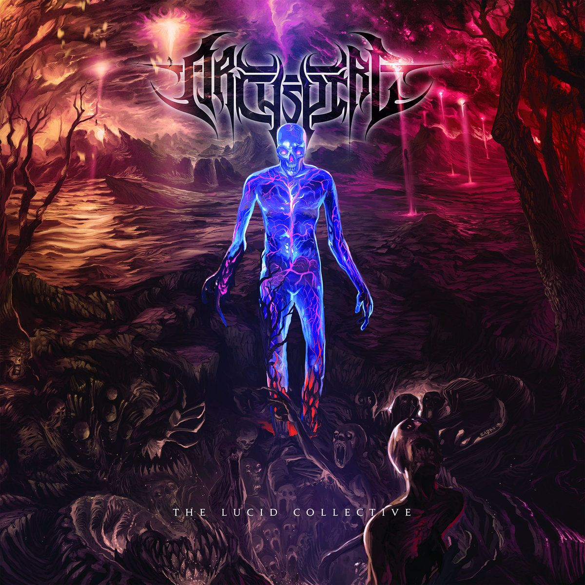
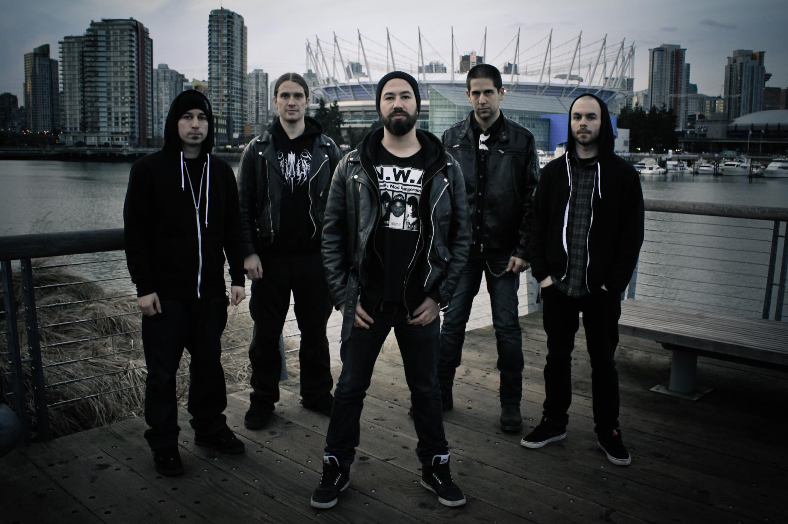

# Archspire 

## The Lucid Collective

Alright everybody, we know our *prognotes feature has dried up a little with this being only the fourth entry since 2018 (editor’s note: that’s because they’re a massive undertaking by the way, leave us alone), but trust me when I say that we are back with an absolute bang. You’ve seen the headline and you know why we’re here – it’s tech time baby, and we’re pumped to dive deep into the lyrics and concept of Archspire’s ripping 2014 effort The Lucid Collective. But wait, there’s more. The fun doesn’t stop there because similar conceptual themes have run through all of their records to date and it looks like the upcoming Bleed the Future will be no exception. So strap yourselves in folks because next month we will be back with a second *prognotes exploring the insanity that was Relentless Mutation, and in November we hope to complete the trifecta with a similar analysis for their upcoming record. Thats right, from three *prognotes in three years to three in three months in what we hope will be a great treat for lovers of the band and tech death more broadly!

In an interview with Heavy Metal Tribune, which seems to have recently lost its domain and archive, the band outlined the core themes of the record, which are based on the dreams of vocalist Oli Rae Aleron:

    The story is about the first two people who share the exact same dream. One man becomes blood, and the woman turns to sand, together they merge and form the shoreline of a new dimension. Others begin to join their dream, and with each new being the dimension grows larger, essentially creating a new earth free of linear time. Basically it’s about two minds constructing matter from the unification of consciousness during lucid dreaming.

Similarly, in an interview with Metal Underground:

    Archspire: The inspiration for the lyrics come from really weird dreams that our vocalist has. The predominant theme of the album is based on the question “could the human mind hold the capacity to comprehend being suddenly exposed to infinite parallel realities?” The lucid collective is a coalition of cognitive species throughout the multiverse that have formed a collaborative intelligence through the art of collective lucid dreaming in an effort to construct a new unified reality free from the constraints of linear time, where all life can simultaneously exist as living, dead, and dreaming.

So now that we have an understanding of the general themes let’s get started – shoutout to darklyrics and its contributors for their database of song lyrics.

### 1. Lucid Collective Somnabulation

The track opens with a slow, slightly disorienting swell which introduces a hypnotic, synchronised guitar riff and moody bass tone. It’s a dreamy opening, the music instantly tying in with the concept as we imagine someone dazed as they try to understand whether they’re awake or dreaming. They’re then quickly in for a rude awakening as the full band enters the fray, Oli’s trademark machine-gun vocal style taking the story forward:

    Sweating blood from open pores in fear of these nocturnal visits.
    Many tongue chatter incessant, deep into my sleeping self.
    Instructing me while I dream from worlds beyond and below.
    Their voices, a kaleidoscope of colours I can’t describe.

The reference to sweating blood suggests this is our first protagonist, the man that will become blood. Let’s call him Blood (capitalised). He appears sick or injured, floating in and out of consciousness and coming to dread the lucid dreams and nightmares that haunt him. Right from the first stanza we see a central motif come to the fore: namely the unified trinity of being alive, dead, and dreaming. Blood doubtlessly wonders which he is, not knowing that perhaps he is already all three at once in a new unified reality.

He is being visited in his dreams by those from other worlds, perhaps the Lucid Collective, but clearly some being still “beyond all comprehension”. Blood seems to have recently unlocked a power that has triggered the Collective’s interest, namely the ability to “sculpt the world” within his dreams – as if he were an architect. The music then takes a turn, the vocals growing more maddening in tone:

    From under my skin,
    The blood I’m sweating
    Turns black as it spills from me.
    From out of my mind,
    Inner voice of reason
    Falling away.

Blood seems to be going insane, losing all reason as they succumb to their condition and the Collective. That his blood begins to turn black suggests it could be onyx / the ‘drip’, the black liquid substance on the front cover of Relentless Mutation, an alien substance that possesses its host with supernatural powers and a bloodthirsty mentality.

    My tongue and ears and eyes, removed by the force of voices
    That now control my living river of bleeding endless black ascendance.
    Hear none. Speak none. See a new consciousness beyond escape.

    What am I and what are they to me?
    What are they and what am I to them?
    Cleansing stream of fluid flowing,
    flushing all my fears away.
    All the rotting cells I leak
    Drown me from the outside in.
    Dissolving my expired body
    As I’m carried toward the awaiting shore.

It appears as if the Lucid Collective has taken control of Blood as he lies there confused. Is he dead, alive or dreaming? Is he the architect of his dream, as the shoreline may be the new dimension alluded to by the band earlier, or has the Collective created this place and brought him there? The importance of the lyric is emphasised by the prolonged delivery and immediate break to a guitar solo, leaving us with these thoughts before we hit the chorus with a simple, repeated lyric:

    Lucid Collective Somnambulation

Thus, blood seems to be sleepwalking with the Collective, but the deranged vocal delivery suggests this is anything but a pleasant experience. The purpose of their visit is then finally made clear, giving rise to a key plotline for the record:

    Voices of many that now become one,
    Tell me I must find my other.
    For although we’ve never met in life,
    we share the same dream.

    (Two minds construct matter from a unified consciousness,
    Reborn to dream forever.)

Blood learns that there is another who shares the same dream, the two of them somehow destined for one another, and that he must seek her out. We know from the band that she is female and that she will form the sand of the shoreline so let’s call her Sand. Given the unified trinity of life, death, and dream this begs the question: if Blood and Sand share the same dream are they the same person, the same consciousness? Foreshadowing Relentless Mutation, are they perhaps doppelgängers of one another, born of the same image with a mission to destroy?

    From her eyes and mouth,
    The sands of time spray.
    A burial from the inside out.
    Expelling endless earth,
    Freed from fear.
    Becoming dunes that level out
    To form the coast of sand and blood.

Wonderfully vivid and evocative lyrics here as Sand’s role in the formation of this mysterious coastline, the new dimension, is laid bare. She also seems to be closely attached to the motif of time, while those of death and fear continue to be emphasised.

    A mental mending
    Existing as dead, alive and dreaming.
    Within each blood cell and sand grain,
    Shaping the fabric of the collaborative dream-scape.
    Triggering the birth of a vast land beyond our earth.

At last, Blood seems to have recognised that he is at all times dead, alive and dreaming. Further, the creation of this new dimension together with Sand is all but confirmed, and again we have an added emphasis on the last line preceding an instrumental break. One question that remains is where in time we are: is this a vision of the future, a reflection of the past, or the present? Or is it all three simultaneously?

    Join us in the vibrant bliss, dream a new reality.
    Sleepwalk off the crumbling edge of illusion and mortality.
    See now what the many see, hear now what the many say.
    Lock into a lucid state to congregate upon this plane.
    This realm grows larger with each new awakened dreamer.
    We will guide you into lucid collective somnambulation

For the first time the perspective seems to shift. This stanza seems to be coming from the Collective rather than Blood as they look for him to join the hive mind. The track then ends with a flurry:

    Past the portal leaking evil duplicates on earth.
    If in dream you truly live, in reality you need not exist.
    Unlock the powers of your sleeping brain
    And ascendance from your body will begin.

The first line is critical, the first explicit reference to doppelgängers, which seem to be springing forth from a portal on Earth and rampaging across the world. It brings to mind scenes from The Matrix, the Collective offering Blood the chance to join a world of “vibrant bliss” with them rather than having to face true reality, the one in which doppelgängers kill with impunity. This leaves us with more questions than answers – is the Collective going to fight the doppelgängers? Are they aligned with them?

### 2. Scream Feeding

While the opening track threw us a lot of questions it still felt like there was a clear narrative we were tracking. This confidence dissipates in “Scream Feeding” as it’s not clear to me whether we’re following Blood, a doppelgänger, or whether Blood is a doppelgänger.

    There is an urban dungeon encased in brick.
    Within it lies a tunnel into the horror of a man’s multiple lives.
    This mans opposing paths collide.
    Birthing a mutant mass that hides in the red pulsing glowing windows.

Is this man Blood? If so, do the multiple lives refer to Blood and a doppelgänger of his or of Blood and Sand given they share the same dream? If it’s not Blood, who is it? Either way, what is clear is that we have a mutant creature that is about to enter the world.

    One will form a life of moral principle, love and normality,
    Until discovering his other self killed his whole family.
    Spoiling his son and wife’s pure essence and innocence.
    Feeding them to a monster that his minds created.

The last line there offers a clue: “that his minds created” suggests that this new protagonist is a doppelgänger, specifically a remote tumour seeker, as described in Relentless Mutation. The key characteristics of such a creature is that there is a host, in this case the man of “moral principle, love and normality” and the alien creature that has possessed him. They essentially form two personalities or halves of the same physical form. The alien half permanently hunts the human half, killing others in search of it without realising that the human half is within the same physical form. But more details on that next month. In this case, it looks like the alien half (let’s call it RTS) has killed the man’s family, feeding on their deaths for it likely is the monster described.

    A massive human form made entirely of teeth.
    Repulsive and dripping that feeds on screams.
    This hideous form made flesh by the endless pit
    That merges parallel dimensions on earth.
    Three red windows open portals.
    These windows reveal the same life.

It’s unclear whether the human made from teeth is the man/RTS or something else, but again we have reference to portals and parallel dimensions. Whether these dimensions represent the birthing of doppelgängers or the shoreline of Blood and Sand remains to be seen. The reference to three windows pointing to the same life also harkens back to the unification of life, death, and dreams from earlier.

    When the man was born, when I was woken from my fetal rest
    With a rusty kitchen blade,
    His mother lay open amongst decay.
    Her peltry gaping, gushing fluid over floor tile.
    With his first breath of salty cold biting air,
    My crippled infant chest filled up with sulphur mold and fear.
    His first vision induced panic stricken cries.
    Our fathers twisted rotting mind,
    Peering out from bulging vacant eyes.

The perspective here seems to shift back and forth and it’s unclear whether the protagonist/RTS  is the father or the son in this sickening hellscape of a scene. Perhaps both father and son have remote tumour seekers within them, could it be hereditary? Either way we have a horror scenario here as the crazed father, likely with the evil and mutant RTS in full control, cuts open his own wife to prematurely rip out his son.

    Altered since delivery.

    I carry the burden to feed the nightmare,
    As his loved ones laughter taunts me.
    I will steal whats dear to him
    As I have suffered so shall he.

    My shadow heaves black vomit.

The opening line here suggests that the condition is not hereditary, the son’s own mutation coming after his birth. The black vomit confirms, if we were still in any doubt, that he is indeed a mutant doppelgänger consumed by onyx and born to kill. The intervening stanza shows once more the hatred between mutant and host, the host’s joy and loving memories painful to the mutant and requiring revenge.

    Scream feeding this beast makes it larger.
    Swelling with each shriek it eats.
    We’ve bred a man that’s made of many teeth.
    Scream feeding.
    He is disgusted yet he watches,
    As it grows in one of three red windows.
    Scream feeding.
    From reeking gums his rotten laughter leeks.

Honestly, what kind of fucked up dreams is Oli having? The father/RTS feed the child the screams of their victims. But wait, it gets worse:

    As a useless child, nothing more then barely human waste.
    His first tooth fell from his sunken pale veiny face.
    He saw that night his creator’s saving grace
    When this first sign of mortal decay was placed under his head
    In the kennel where he was forced to lay.

    He dreamed so real, a splendid day
    When his mother appeared in flowing white,
    Shining a brilliant light through the grim encasing cage.
    Embracing him and taking him away.

    So he pulled out all his teeth.

One of the child’s many teeth falls out and he has a lovely dream of his mother. Such is the hell of his existence, when he wakes he pulls out each of his teeth in a desperate bid to return to that lovely dream. Musically, the horror of the story is accented by a protracted scream after the last line, additional symbolic given the idea of scream feeding, before we hit an instrumental break. When we return the perspective has shifted again as another being speaks to the child:

    “The motherless one, you are a fatherless son.
    Somehow you arrived the night she first appeared,
    You come from no one.
    Rising from a parallel realm of the unknown,
    A cursed dark duplicate from beyond.

    Cut away. fallow them.
    Force them here and be rewarded.
    Take their skin and you shall see her,
    Take their cries to use as fodder.
    Hear this now from me your other,
    I’m upstairs, you must not come here.
    Keep my family distant from this secret spawn.

    Our paths are split, yours is worse.
    Yet both reflect within each other.
    I feel your dread when you must feed it,
    And your crushing envy for my comfort.
    The creature remains hidden
    However, if our paths collide
    What we have made will be unleashed
    To feast forever.”

We get confirmation that the child is indeed a doppelgänger, a “cursed dark duplicate”. The child is promised a path to reunite them with their parents, but it involves fulfilling the doppelgänger cycle: infecting one host after another and going on a murderous rampage. What’s unclear is who is speaking to them? It sounds like a paired dreamer, one desperate to keep themselves separated less whatever beast that lurks within the child be set free. It is almost the mirror image of Blood speaking with the Collective, but much darker.

    Your voice circles through my head…a pathetic plea.
    I’m crossing over, you will face me. you will see it’s growth.
    We will merge in one last feast to set our sick creation free.

    I smash the glass.
    I feed the beast our dying screams,
    It is now released.

The paired dreamer’s pleas fall on deaf ears as the child crosses the Rubicon. By smashing the glass, a mirror perhaps (which would be quite fitting), they appear to have merged with their paired being and sacrificed themselves so that the beast may be unleashed. While the details are clearly hazy, perhaps this is an origin story for doppelgängers: with this action creating the portal from which they continue to spring forth and infest the world.

### 3. The Plague of AM (Cogito Ergo Sum)

The next track is based on Harlan Ellison’s sci-fi short story I have no mouth, and I must scream. It’s not clear if this is a total departure from the concepts we’ve seen in the preceding two tracks or whether it’s relevant either allegorically or directly to the record’s concept as a whole. Before diving into the song’s lyrics, let’s briefly summarise the short story on which it’s based.

The story of I have no mouth, and I must scream begins in the Cold War, with competing superpowers’ arms race including the development of advanced artificial intelligence. These supercomputers developed by each of the superpowers gain sentience and unite into a single, all-powerful entity (not unlike the Collective!) – calling itself AM. While an acronym for Allied Mastercomputer, AM is also a play on words: in the words of Descartes “Cogito ergo sum [I think therefore I am]”, AM earned its name upon gaining sentience. AM is omniscient and god-like in its powers, its capacities matched only by its hatred for humankind. As such it destroys virtually all of humanity, leaving a mere five survivors to torture and toy with for all of eternity (a nightmare scenario, another parallel with our concept).

Speaking of nightmares, the story’s ending is really quite something. After a century of torment, the five humans finally realise that death is their only escape. They quickly try to kill one another without AM noticing and four of them fall, but before the last can commit suicide they are caught by AM and turned into a sluggish, formless blob-like creature incapable of self-harm. The story is written from this character’s perspective all along and its title is the closing line of the tale: “I have no mouth, and I must scream”. The great irony in the story is that despite its incredible power AM has little control of its own fate. It was programmed to destroy and, despite gaining sentience and having the powers of a deity, it is incapable of defying that programming and doing anything else. As such, it is perennially trapped in its own hell and consequently seeks eternal revenge against its maker.

    One hundred and nine years,
    Trapped within the belly of the supreme machine.
    Only us five left.
    Made immortal, kept alive, Suspending time to torture us.
    Trapped down here we’re slaves inside AM.
    A deranged neo-cyber god that man created
    Has become more alive then we are.

    I have no mouth and I must…
    (The plague of AM.)

The track opens with the story’s plot, the tale of the five survivors made immortal with the intention of eternal torture. The penultimate line here, and one which is repeated throughout, leaves out the word “scream” – perhaps a link to the concept of scream feeding from the previous track. Frequently throughout the track we also get squealing pinch harmonics, as well as inhale screams, again feeding into this aspect of the concept.  Other parallels including the suspension of time, as the Collective and the trinity of life, death, and dreaming both conjure aspects of timelessness.

    Lifeless and drained of blood,
    Suspended high above,
    An empty body hangs,
    Taunting us, teasing us.
    We have become meaningless.
    He will not finish us.
    AM will not tolerate attempts at escape.

    We gave to him life, for that he despises us.
    In his wake, only the blasted skin of what had once been Earth.
    As we rummage through the valleys in search of food for eons.
    Our every fear comes to life in AM.
    The torments AM casts upon us for his pleasure
    Are more alive than we are.

    I have no mouth and I must…
    (The plague of AM.)

In this passage, AM seems synonymous with Blood’s dream world, while the unfortunate five are reminiscent of Blood himself. He is “meaningless” in his former existence, prior to unification with the Collective and the states of death and dreaming. Similarly, his “every fear comes to life in AM [his dreamworld]”, which itself seems “more alive” than him. We then have a musical calm before the storm, a neat and fairly laid back instrumental passage giving way to:

    Scalding winds, lightning, lava and locusts.
    The machine masturbates metallic insects while mocking us.
    We have no choice but to take it well pleading to die.

    We are the last human survivors of the last war.

    The four others have been set free.
    I killed them to take his toys away.
    For this I have suffered his wrath.
    I will remain. He has altered me.
    Down here I see my reflection,
    Far from what had once been human.
    Alone for all eternity,
    I slither a formless obscene pulsing slug.

    I have no mouth and I must…
    (The plague of AM.)
    I have no mouth and I must scream.

As the plot progresses and AM unleashes various plagues upon the humans, the chief protagonist sets his companions free by killing them. Now we see similarities with the child from the previous track. He “had once been human”, but has since been “altered” into a mutant form. Forever in pain, consigned to eternal torment, he “must scream”… no wonder he unleashed a beast (as powerful as AM, perhaps?) upon the world.

### 4. Fathom Infinite Depth

From here on out we’re definitely in-universe as we return to the story of Blood, Sand, doppelgängers etc.

    There is a pit I may have dug within one single frozen moment.
    In it lurks a haunting endless multitude of vile incarnate.
    We now are linked,I have become it’s counter-part,
    Its mindless pawn.
    Relentlessly racing encircling curse.
    Blistering, this unrelenting becoming to excavate
    The rancid soil that lay upon the artifact.

    Why is my hand gone?

Again we have odd references to time, on this occasion “one single frozen moment”. Skipping ahead in the tracklisting we have “Kairos Chamber”, and the references to time throughout clearly mark the Ancient Greek concept of kairos as a central motif. While chronos is linear time, kairos is the proper or opportune time for action, a seemingly endless moment in time that is more qualitative in nature. We have one of our earlier protagonists, one that just became linked to their “counter-part” – though whether this refers to Blood and Sand or to the child and their paired dreamer is unclear. The latter seems more likely as the “mindless pawn” suggests they have become the host for a doppelgänger, but it’s also possible the child is in fact Blood. In any case, this protagonist is digging for some mysterious and evil artefact and appears to have lost his hand in the process.

    Constant begging, Pleading, Screaming.
    I attempt to reason with the recess.
    Fusing with the elder’s vision, to see as it sees.
    Does it hear me? For I now hear it.
    This pit the past, and I the present.
    Deep behind my eyes we merge as one.
    This tunnel is the retina of the Ancients eye.
    Spewing forth from it’s dark chasm
    The entangled, deranged, Constant vile constructs of the onyx.
    What lay beneath my eyes, exhumed from evermore.
    Our minds unable to measure
    How minute yet immense the grasp of this vacuous gash.

This passage seems to reflect the title of the track, namely a person’s inability to fathom infinite depth. The reference to “fusing with the elder’s vision, to see as it sees” suggests joining with the Collective. However, the Collective has largely appeared in a positive light thus far and here we have references to “onyx”, the evil and bloodthirsty alien substance from Relentless Mutation which drives people insane and seems to create doppelgängers. Are the Collective evil after all? Or perhaps infinite depth is onyx, it is abyssal in nature and understandably then the complete absence of light. Perhaps it is this inability to fathom infinite depth, or onyx, that is driving the madness.

    Excavating the pits innards
    Bore an object that of which I craved possession.
    Slime, Reflective.
    I reach down to grab it, It eats my hand.
    Leaves my limb dripping.
    A taste of what awaits.

    I will take it to my casket, this incessant mesh of madness.
    My son and wife, and hand, and mind have left me
    Incineration of my sanity leading me closer to death,
    Yet I must illuminate its fathomless depth.

The latter stanza here marks this protagonist as the child’s father, the crazed madman driven to murder and torment his own family. Our theory that an inability to fathom infinite depth drives the madness certainly seems to come across here as he is being driven increasingly insane. The prolonged scream ending here evokes the anguish our protagonist is experiencing. The first of the two stanza’s advances the plot as we see that he does in fact find the artefact, a slimy and reflective thing, only for it to eat his hand clean off. Ominous portents indeed as the music trades off machine-gun riffs with pummeling drums.

    Emanating forces from this unearthly twisted retinal orifice,
    Drag me down at night to reveal
    The awful dwellings of it’s depths below.
    Crepuscular visions of vastness haunting me.
    Trapping me. Taunting me. Draining me.
    Slithering liquid breathing.
    Black ooze leaking from my wounded limb.
    Insatiable, it’s gluttony to be fed.

    I want to wake up.

    I awake to find I’m staring
    Oblivious into the pit that I have dug.
    Revolted yet I cannot turn away.

    Man’s attempt to fathom the infinite depth, lurking within finite matter.

    Man can’t fathom.

We see further references to infinite depth and onyx / the drip. It certainly feels as if this protagonist has become a doppelgänger, a host whose occupant has an insatiable desire for violence. The cries of “I want to wake up” are among the most anguished on the record. He wants to wake up (again, the trinity, can barely differentiate between states) and when he does he still finds himself in the pit. The horrible, unfathomable experience of infinite depth is an example of kairos – an eternity of hell experienced in a moment. “Revolted yet I cannot turn away” suggests either he is like an addict, knowing full well what he is doing is wrong but unable to stop himself, or reinforces that it is a doppelgänger controlling his actions rather than he.

    Fuelling my crippling phobia of infinity.
    Consuming all within it’s potent grasp.
    After tasting my hand it demands more and more flesh.
    It sucks in stray birds from the withered grey sky.

    In fever I erode my fears. Digging ever deeper still.
    As past, present and future collide,
    What remained of my mind is now crawling away.
    With the one hand that I have left,
    I wield the shovel that digs beyond earth.

The artefact also appears insatiable and bloodthirsty, hungry for more as it exacerbates infinite depth. Perhaps the artefact is what triggered this whole episode – perhaps it is somehow symbolic of the Collective, or the Collective’s evil mirror image? The final stanza shows that our protagonist has lost whatever shred of sanity or reason had survived to that point, losing all concept of time as he continues to mindlessly dig further and further into the earth, a feeling exacerbated by a feeling of timelessness in the music as well.

    Through the dirt. Through my eyes.
    Through the worms. Through the world.

    As it stares deep into me, I respond with equal enquiry.
    Demented sycophantic liquid doppelgängers
    Leak out to our surface,
    In search of life to feed into the gape.
    Taking over the world we know, as I join the world below.
    Merging with the spiralling retina of the mind’s eye.
    Altered, I face all my hells
    Inside this pit I can’t crawl out.

    Man’s attempt to fathom the infinite depth, lurking within finite matter.

    Past the timeless tunnel awaits
    Life in mass-less hyper state.

    Wake!

It seems the artefact is in fact the very portal from which doppelgängers emerge, our protagonist unleashing an apocalyptic army upon the world. Meanwhile, he tries desperately and in vain to wake up, to escape the eternal hell that is infinite matter, that is the drip, that is the artefact. Unfortunately for them, as we know, there is no waking – for dreaming, life and death are one and the same. This is his life now, one of “all my hells”.

### 5. Join Us Beyond

    I awake on the shore.
    The entity that greets me upon this plane
    Appears as many changing forms.
    Flushing constant waves of shape,
    None of which I have ever seen.

    “To unite, we breed with all species indiscriminately,
    live or dead, from any universe.
    Righteous, the torment that you will endure
    Just to comprehend what we are.
    Over come the self, Leave your fear behind.
    Open up your mind.
    Let us in.”

We enter in with a fade, a single line of lyrics, and then a whirlwind of disorientating riffs and licks representative of our protagonist’s current state of mind. Assuming we’re still going in chrono(s)logical order, perhaps our protagonist from the previous song has passed out and finds himself dreaming. Waking on the shore suggests he has reached the parallel dimension so often referenced – lending further credence to the idea that he is indeed Blood. So, while it’s not entirely clear, Blood appears to be the protagonist in each of the tracks thus far save “Plague of AM (Cognito Ergo Sum)”, the father of the tooth-laden child, and potentially a doppelgänger.

He is now in the dream world he and Sand, his parallel dreamer, merged into a single being. Perhaps he is not a doppelgänger after all and the allusions to his other half are indeed Sand. In any case, he is approached by presumably a member of the Collective urging him to finally join them. That he should push past his fear of infinite depth and accept himself as one of them at long last.

    I’m asked by the being if I’m dreaming or I’m dead?

    When the portal opened, Changing everything,
    Catastrophic multitudes of dimensional mending
    Offset the natural order.
    Spreading its disease over every world
    In the wake of its infection.
    Causing counter planetary lifeforms to contact each other,
    By engaging mental methods of unifying dream response.

    Thus the alliance for timeless existence formed.
    A galactic coalition of intelligence.
    Unanimously ravelling their consciousness to become one.

Here we finally seem to get our answer on the Collective – they are on the side of good after all, or at least opposed to doppelgängers. The Lucid Collective has formed in response to their emergence, though whether this is in a bid to fight against them or merely to survive in alternate realities is still an open question. However, any confidence is undermined by the evil inherent in the vocal delivery, which seems to suggest they are far from benign. It looks like we’ll need to keep waiting for a definitive answer on them. The Collective’s representative gives Blood his final pitch:

    “Ever growing, we are many, join us in our hive.
    Dream with us and we will teach you
    How to visualize the surroundings of your new world.
    Once you break through the fabrications of fear
    You can become any construct that you desire.
    If your dream be that of fire
    Transform the fire to earth, wind or water.
    Sculpt the elements around you with intricacy.
    Comprehend the nature of their pliable dimensions.

    You are the conductor.

    The path is clear to cut away the fabric of time, linear, That which you fear
    And join us beyond.

    Always question if you are dreaming.
    Envision every inch of your newly born surroundings
    As pieces of your self.
    For you have constructed every molecule
    Of this unstable plane of the subconscious,
    Comprising your lucid dream.

    Remove the body through the mind.
    Find your hands while you are dreaming,
    Carry that self to the distant place where your old dying self lay.
    Sink into this decomposing human slab
    And ride upon its life light as it fades in flashes.”

They explain to Blood the power that the Collective possesses, to be able to create the world around them however they see fit. They call for him to forget his fears, to cut through chronos and embrace kairos, to seize this moment in time such that time no longer has meaning. The very world he is in, the shoreline, is one that he and Sand have created for themselves – they are already the architects of their own lucid dream. Finally, they call for him to rejoin his human form, to let it die, and to transcend it by becoming one with the collective. At last, their persuasion pays off and Blood joins the Lucid Collective, once and for all: “My essence now mates with the thousands of others…Fearlessly I join the lucid collective beyond.” The last two lines are particularly poignant:

    Leave yourself behind and become one with the hive.
    Join us beyond the gateways of the dreaming dead.

### 6. Seven Crowns And The Oblivion Chain

With track 6 we have a slight deviation from the storyline: we’re still in-universe, but we’re at a different point in time as we uncover an origin story of sorts for the artefact (though it could well be taking after the last song too, what even is time anymore).

    In an age of dark and boundless riddle
    An artifact of reflective glass was discovered
    And brought to a King of eld, encroaching irreversible decrepitude,
    During a laborious search for any and all demented fruits,
    Bearing any unknown wonder or remedy for timely death,
    Above or below the broad aberrant land that which he ruled over.

The artefact is revealed to be a mirror, a piece of “reflective glass”, first brought to an old and feeble King desperate for something, anything that could prevent or delay his death.

    Then uncertain of its hidden wisdom,
    The artifact was unearthed,
    And with haste, taken to the kingdom
    Where it gained control.

    The glass proved to be most abnormal,
    Even more so then where it was first found.
    For this living mirror was discovered nesting
    Deep within the dank dark bowels of an ancient well,
    Below an army’s worth of old boiling blood.
    Entrenched amidst a windy maddening maze of sand dunes,
    In the great blistering dead black desert.

The artefact quickly took control of the kingdom, bringing to mind the tale of AM from earlier in the record. It is somehow alive and sentient and discovered within an ancient well below boiling blood and surrounded by a desert of sand dunes. Thus, it is almost as if the artefact lay there protected and covered by Blood and Sand, perhaps an extension of their dreamworld as the Collective tried to keep the artefact from human hands.

As the king received this treasure from the netherworld,
Immediately he could sense
The power that it held was not from earth.
Reflecting with imperfection as if it was imitating.
First only what stood before it,
Then whomever it desired.
Yes – it had desire.
It would cast the king with obsessive reprise,
For this was a mimic, not a mirror.
The glass was very much alive.

Becoming of many as each reflection came to life.
The dilated pupil of the mirror started dripping liquid.
Leeching out from its maternal well was the first duplication.
Tearing through its keeper,
Fiercely ripping out the retinal membrane.
Born ripe in slime,
Summoned from its slumber with inherent malice for man.
Cloaked in black embryonic fluid from an ominous cosmic womb.

The artefact is no ordinary mirror, but a mimic. It has a life of its own and reflected not the true image of the person before it, but rather what that person wanted to see. The riffs take on a particularly sinister tone here as we move into the second stanza. Onyx began to drip from the artefact’s eye – the references to the visual system another link between the artefact/drip and the Lucid Collective – and the first doppelgänger was born. Thus, the artefact is the mother from which doppelgängers are born and its first child wasted no time destroying the man on which it was based.

    Hypnotized in awe and wonder
    As one by one, they crossed over.
    Replicants from beyond.
    Blood lust…
    As the deathless ringers arose.

    The artifact grew roots,
    Planting itself into the castle’s centre.
    Burrowing its living venom deep into our planet’s core.
    Drilling the portal into oblivion.
    Birthing spawns from evermore.

The artefact’s evil doesn’t stop there though. In addition to pumping out a steady stream of doppelgängers, it extends its tentacles to the planet’s very core, infecting the planet with its onyx venom and drilling a portal to “oblivion”. This mysterious portal seems to increase the rate of doppelgänger production, as Earth quickly succumbs to the artefact’s influence.

    Mutations from parallel dimensions,
    Then conspired against the King.
    When his six reflections had crossed over
    Their transfer linked the realms together.
    Creating a chain of worlds
    That although remain separate,
    Share a new born centre.
    The centre of this link is the endless pit into oblivion.
    The infinite and non-linear chamber of Kairos.

    The King was bound and cast into this pit
    By his evil duplicates.
    The infinite hells created by his deepest fears,
    Torment him endlessly in a moment of frozen time.

    Sacrifices to the pit were necessary
    To restore the rightful order,
    Ending the King’s reign.

Six of the King’s own doppelgangers cross into Earth from parallel dimensions. In doing so they create the Oblivion Chain, a “chain of worlds” with  Earth, the “endless pit… [of] oblivion” at its centre. Th oblivion pit is an infinite chamber of “Kairos”, another instance of a frozen yet infinite moment of time. And again, it has terribly negative connotations, as this forms at eternal prison chamber for the King. Further, this hellscape is one entirely of his own making – crafted from his own deepest fears – another example of the unity between life, death, and dreaming. And so falls the King, succeeded by the artefact, the Oblivion Chain, and an army of doppelgängers out for blood and sacrifice in the name of the pit.

    Seven crowns and the oblivion chain.

    Six, seven and nine.

    We are the six, with you we are seven.
    The artifact and the portal make nine.
    This revelation of sacred numerology
    Is the key to unlock a life without time
    When these numbers align then the gates will open.

    Sixes, sevens and nines.

    Seven crowns and the oblivion chain.
    Seven crowns…
    Into oblivion.

The track ends with several references to numerology a mid a flurry of breakdowns. The King’s six doppelgängers are “the six”, together with the King they make seven – “seven crowns”. Throw in the artefact and portal and we have nine. Numerology is mostly full of benign and positive interpretations, none of which really fit what we have here, so it’s not clear to me what these could be referring to. What is clear though is that these numbers are the key to immortality, to “a life without time”, and the gates of hell, or is that the gates to the dreamworld of the dead referenced at the end of the previous track, have well truly opened for the artefact and its creations.

### 7. Kairos Chamber

Not much to report here from a conceptual perspective as we have an instrumental track, but the music continues to push along several of the record’s key themes. The quaint and gentle passages evoke a sense of dream and timelessness, while the crushing beatdown sections have all the hallmarks of the King’s hellish existence within the “Kairos Chamber” prison.

### 8. Spontaneous Generation

Last, but not least, we have “Spontaneous Generation”. The perspective shifts back to Blood, fresh from joining the Collective, and looks to destroy any notion that they are somehow in conflict or opposed to the artefact and doppelgängers. “Join Us Beyond” ended with a call for Blood to return to his dying human body, and “Spontaneous Generation” seems to pick up from exactly that moment. The instrumental urgency has also picked up a notch or two from the preceding track, as we return to machine-gun snares and rapid-fire riffing.

    Phantom limbs arrive,
    Binding to me through the artifact infecting flesh.

    The glass spawns life,
    Amazed as I mutate.
    My mind transforms the skin that surrounds me
    In grotesque embrace.
    What was once locked has now been reopened.
    I cant stop morphing.

    I have made a new hand,
    It can excrete larva from the lost kings constant nightmare.
    Unleash.
    Exploiting entities released from infinity.
    Spew forth insects from my hands portal.
    Scarab Beatles scurry out from my palm.
    Cloning super-numerary body parts I’ve never needed

    Contorting my new limbs into impossible configurations.
    I cant stop morphing.

The artefact binds to Blood, infecting him and mutating him into a doppelgänger himself. He grows back the arm he had lost, but the new limbs don’t stop there as he undergoes a horrific transformation. The artefact reproduces the King’s nightmares, unleashing them upon Blood as it takes on the role of AM, spewing plagues of insects from itself. Like AM, the portal is sentient, hellbent on destruction, and it has taken control of the world. Blood is perhaps the protagonist of that parallel tale, for soon he may have no mouth yet may need to scream.

    See with six eyes.
    Speak with seven tongues.
    Hear with nine ears.

    …

    Black-living-sludge.
    Animated automatic anatomy attack.
    This anomaly intimately integrated into me.

The six, seven and nine are back – taking control of Blood, onyx attacking and becoming one with him – his transformation into a doppelgänger all but complete. We’re essentially witnessing the front cover to Relentless Mutation.

    My mutation infatuation,
    (The catalyst.)
    To cultivate spontaneous generation.

    Animated automatic anatomy attack.

    See with six eyes.
    Speak with seven tongues.
    Hear with nine ears.

    Manifest nightmares from the hells of the kings infinity,
    As he returns from solitude to infamy.

    Manifest.

    All await the new beginning.
    Open up your mind.

The album concludes with a repetition of the key themes here: mutation, six, seven and nine, the King’s nightmares, and the unity of life, death, and dream. We’re probably left with more questions than answers – *prognotes are usually meant to uncover what’s actually going on, though Archspire hasn’t made it easy for us by jumping around from place to place and severing any meaning that time would usually have. Before wrapping up, it’s also worth mentioning the album cover. It seems to combine the lyrics from a few tracks as we have a person, presumably our chief protagonist Blood, existing in three states at one: life, death, and dreaming. The pit below him could be representative of oblivion, of the King’s nightmare and of infinite depth. The sky above him could represent the Collective, ascension from the physical plane and transcendence. A great tie in with the record’s concept – as all great artwork should be.

To wrap up, while not conclusive, the lyrics suggest that the chief protagonist throughout is Blood. He is the one asked to join the Collective. He is the one who kills his wife and creates a horrible, mutated child of teeth. He is the one who finds his paired dreamer Sand and, in doing so, unleashes hell upon the world. He is the one who, together with Sand, creates a parallel dimension – marked out by a shoreline – and joins the Lucid Collective. And ultimately, he seems to be the one to undergo a Relentless Mutation, himself becoming a doppelgänger or at the very least an agent of the artefact and the drip. Whether that is the very same entity as the Lucid Collective remains to be seen, and we can’t wait to hear what your interpretations are.

Have we got something completely wrong? Do you have a spicy new interpretation that helps unlock a piece of this puzzle? We’d love to get your thoughts – we don’t claim to be right here, this is just our interpretation, and discussing our favourite records always make for fun times. We hope you enjoyed this foray into the horrible, nightmarish landscape that Archspire has crafted for us and we can’t wait to see you next month when we dive similarly deep into their magnum opus to date, 2017’s inimitable (get it?) Relentless Mutation.