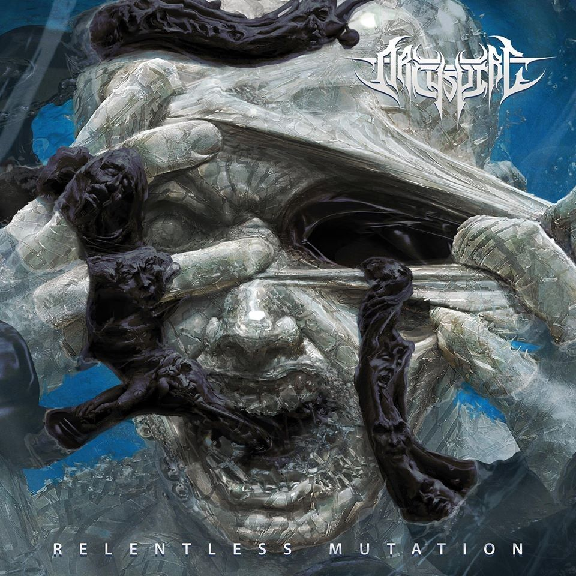
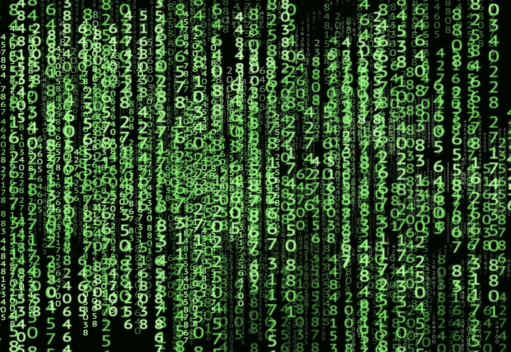

## Relentless Mutation

Welcome back everyone to our continued analysis of the lore and concepts Archspire have constructed in their ripping discography. Today we of course dive into one of the clear standout releases from 2017, the stunning Relentless Mutation. Before we do that though, let’s briefly recap what we learned from 2014’s The Lucid Collective.

In broad terms we learned of the Lucid Collective, a group of creatures that have mind-melded into a single, all-powerful entity. Determined to grow in strength and intelligence, the Collective seeks to construct a unified and timeless reality where all are simultaneously alive, dead, and dreaming. We also learned of an artefact, a mimicking mirror, which gained control of the world. Its roots infected the very core of the world and created a portal which bound together 6 parallel dimensions to form the Oblivion Chain. In doing so it consigned the King of an ancient kingdom, the one whose subjects had uncovered the artefact to begin with, to the Kairos Chamber – a timeless hell composed of the King’s own nightmares. Doppelgängers, evil and bloodthirsty aliens made of a black liquid (onyx/the Drip), sprung forth from the parallel dimensions. Once on Earth they seek out and infect people, take control of their bodies, and then proceed to go on murderous rampages.

The majority of the record followed a protagonist, whom we named Blood, a dreamer approached by the Lucid Collective and told there was another person (whom we named Sand) who shared the same lucid dream as he. Throughout the record Blood gradually descended into madness, unable to fathom the infinite depth of matter and parallel dimensions the Collective had opened his mind to, and he was driven to seek out Sand. Blood and Sand merged to create their own new dimension (a shoreline from their dreams), and in doing so they somehow release a monstrous creature (perhaps a doppelgänger) into the world. By the end it even seemed like Blood himself may have become a doppelgänger, such was his madness (e.g. it seemed he brutally murdered his own wife and tore out his still unborn son, who himself became a mutated creature made of teeth).

Now throughout my analysis of the record I was unsure of the relation between the Lucid Collective and the ‘evil’ of the world – namely the artefact and its doppelgängers. Were they opposed to one another or one and the same? Long time Heavy Blog reader Noam (hi Noam!) wrote in saying he felt they were one and the same, with the Lucid Collective selling a dream to lure in new members. Once others joined the Collective grew stronger, while the individuals could be turned into doppelgängers – violently projecting their own nightmares into the world. Very interesting take and I can’t help but agree that the Collective certainly seems more sinister than initially meets the eye.

Anyway, enough about The Lucid Collective, we’re here for the insanity that is Relentless Mutation so with thanks to contributors at darkylyrics.com let’s get into it.

### 1. Involuntary Doppelgänger

    “Dead lives rive
    From my human hide

    When the cult had come for me
    I could have got away, but didn’t
    I couldn’t be the one to cause this any longer

    Had it been a day or a year inside this skin?
    I could not tell, the faces I had captured over centuries took hold”

The opening track kicks off from the perspective of a doppelgänger, though whether they are related to Blood or Sand is unclear. They recall how they have torn people apart limb from limb, capturing all of their faces over the centuries as a doppelgänger. Yet, it’s the middle stanza that is most interesting here. A cult (could it be the Lucid Collective?) came for them and they acquiesced because they could not be the cause of something any longer. What could that be? What could be so bad that one would choose life as a doppelgänger to end it?

    “I became a kind of hunter
    Eating pelts of pleading meat to acquire their appearance
    Taking their form with will alone

    …

    Seen to be a wicked omen
    Despite attempts to hide my live birth mark
    Crown of a dark demon tar
    I’d taken back with me from the other side”

We hear of what our protagonist has become in vivid detail as they hunt and kill their prey, taking the appearance of their victims. One can’t help but draw parallels with the Faceless Men of Braavos, but the irony in it all is that our protagonist is a victim himself – possessed by the drip and controlled by aliens. One must wonder what “the other side” means – is this another dimension?

    “There is no god
    For if there was
    Then how’d this evil take me?
    It seeped and crawled it’s way along my face
    As mother wept

    Stealing identities from every skin it sees
    Growing with urgency

    When he tried to cut it off
    Many a time (To no avail)
    It would take my livid father’s manic features

    Laughing at him as he tried to hack them off his son
    Knowing that he could not end my life
    He took his own

    Mother mourned the death of him
    And knew that many more would follow
    If I didn’t leave right then

    Heading out into the woods
    I promised I would never come back
    I thank the dead that she knows not what I have become”

Did we mention vivid detail? In this visceral passage we hear of the protagonist’s horrific past as the alien took control of his body, taunted his anguished father into suicide, and forced his grieving mother to exile him from the home. As gruesome and terrible as the tale is, as with the previous stanzas, we’re left with a glaring question. If our protagonist chose to save his mother, to leave home and enter the woods, what degree of control do they have? Is the alien controlling their actions or merely influencing them?

    “Decades take me deep into the curses endless undertow
    There is no time or end behind this epidermal prison
    My thread of youth imprisoned
    Tortured by immortal victims

    I am the Involuntary Doppelgänger

    I can not stop it, my skin is alive”

In the first stanza our protagonist confirms that they are essentially immortal, eternally imprisoned by their alien host and tortured by their victims’ souls. This final reflection gives way to a brief solo and then a deep, guttural scream as we hear their suffering first hand. Again we then have the question of control. Are they truly an involuntary doppelgänger when they chose to surrender themselves to the cult? Even in their new form, how much control do they retain?

    “All of the time I’ve spent inside it
    I never thought it could be calling out to any other
    Involuntary Doppelgänger

    Had it grown bored of it’s feed?
    Or gained knowledge with time?
    Whatever the change had been
    I felt it emanating information

    Had it tried to send a beacon
    Warning them to stay away?
    I heard the voices calling back
    Involuntary Doppelgänger“

Ok, now things are starting to get really interesting. The alien host enters into communication with something, presumably with cult mentioned at the very beginning of the track, for the first time in centuries. That communication began so suddenly suggests that something is afoot – either some event has occurred or it is nearly time for something to take place. We then hit an instrumental break with soothing, melodic guitars lulling us into a false sense of security before we’re hit with the crunch of groovy rhythm guitars once more.

    “One last face it had to acquire
    Before it’s caught
    The menace cloak found her
    Still alive and skinning bodies of her own

    It appeared she had done the same as I
    For all this time, to see her son again

    And there I stood
    The cloak of others made her impossible to recognize
    She carved me like any other martyr of our curse
    When the cult had breached our cabin
    Taking me to be a random victim of the doppelgänger

    Heading out into the woods
    I promised I would never come back
    I thank the dead that she knows not what I have become”

Our protagonist thinks he has “one last face”, one last victim, to kill before they are caught (by what?). The “menace cloak”, likely a term for his alien host and the skin of its victims, finds a female doppelgänger busily “skinning” victims of its own. The second stanza suggests that this other doppelgänger may be (or have been) his own mother, bringing this fate upon herself so that she could venture out and spend the centuries searching for him – for her son (again, how much control do the hosts actually have?).

He struggles to recognise her given her own shifting skins, yet despite these difficulties clearly there is some form of recognition taking place here. He is carved open, a “martyr of our curse”, becoming a victim of a doppelgänger. Yet, we’re still hearing the protagonist’s story. So perhaps this passage is actually a flashback to when he was first claimed by the cult, which aligns much more closely with the reference to martyrdom and the likely brainwashing he was subjected to by the cult’s leaders. Another possibility is that we’re picking up motifs from the previous record, namely non-linearity of time and the equivalence of life, death and dream. This could explain how our protagonist could be simultaneously dead and alive, or why they might be seeming to move backwards and forwards in chronological time. The track then concludes with the following:

    “Decades take me deep into the curses endless undertow
    My tongue speaks in a cadence that only A.U.M. can decipher
    Void of bidding heading out a very inner wreathing
    Of a demon with intent to animate and be gone”

Our protagonist’s alien host is communicating with A.U.M., the cult that transformed him into an involuntary doppelgänger to begin with. The cult’s name is reminiscent of AM, the Allied Mastercomputer from “The Plague of AM (Cogito Ergo Sum)” from The Lucid Collective and Harlan Ellison’s short story I have no mouth, and I must scream. Perhaps some of the relevant concepts, such as AM being simultaneously omnipotent over its environment yet completely powerless over its own desires and existence, will apply to the cult as well. The final line is foreboding, with our doppelgänger “intent to animate and be gone”. Looks like we’ll need to wait a bit to see where that takes us.

Photograph of Archspire’s writing process:

### 2. Human Murmuration

    “I was the first to discover what hid in those red windows.
    The one I found there tried hard to survive.
    A child riddled with teeth sprouting randomly
    All over his body (except in his rotting mouth)

    Was taken by us, to our lab.
    Us meaning myself, as well as the assistants I had.”

We’re on the set of “Scream Feeding” from The Lucid Collective, where we were first introduced to three pulsing red windows, each a portal to parallel dimensions, and a grotesque child seemingly made from teeth. It seems that the mutant child has been discovered by a mad scientist, though whether by chance, through the invention of their own portal, or through the intervention of others (such as A.U.M.) is still unclear. The scientist and his assistants take the child away to their lab and, like all horrific sci-fi stories, one can’t help but think this isn’t going to end well.

    “Instructing me of a mission through
    A distant telepathic channel,
    Running directly out from their compound and into my brain.
    Referring to themselves as the A.U.M.
    I was to bring the body back to my quarters
    And await instruction.
    Not an easy task, to transport it.”

For once we have a quick answer to one of our questions! The mad scientist has a telepathic connection with the A.U.M., though there is no indication that he is a doppelgänger. Certainly not when he still has lab assistants to help him. Thus, A.U.M.’s influence must extend beyond doppelgängers alone.

    “Strapping it down to a gurney I dragged it through the alley.
    Unfortunate casualties noticed me.
    Using any tools around at that time, to keep them quiet
    An iron pipe. A broken bottle.
    Or a jagged piece of brick or stone.
    I should not continue to delineate this any longer.

    At one point I had to fake my death
    Until the witness made a close inquiry.
    At that time I had to use the less effective
    Weapons that were born onto me.

    With old teeth and leather hands,
    I took an ear and then an eye.
    I focused force around their skull
    To keep them mute during attempts
    To yell for aid, until they fell.”

Once again we’re painted a striking picture, this time hearing of how the protagonist managed to main and murder multiple people in his aim to get the mutant child to his laboratory. For once though we get the feeling that we’re looking at fairly regular people in a regular city on Earth rather than fantastical creatures, magical ancient histories or the science fiction of parallel dimensions. The burning question though is why is our scientist is willing to go to such lengths? Has he too been brainwashed or is there something else at play?

    “A.U.M. made it painfully clear, I was to bring the body back
    Or I would be forced to witness the drop of black again.

    I cannot begin to describe
    The horror of viewing this maddening drop.
    For the memory bleeds

    to deep into my own
    That the mere thought alone starts to unravel
    My frayed reality.
    Giving way to it’s ominous ability to shape
    And adapt my thought and vision.
    It is beginning to happen now.”

Once again our questions are quickly answered! The power of “the drop of black”, the alien substance that can make one a doppelgänger, seems just as suitable to torture as it is to possession. The scientist cannot bear the thought of witnessing it again, his fear and trauma not dissimilar to that of Blood – our chief protagonist from The Lucid Collective – when faced with infinite depth. This only reinforces our thoughts from the very beginning of this article – that the Lucid Collective might themselves be these alien forces!

If true, then looking into the drop and fathoming infinite depth are one and the same. Perhaps the Collective are (or at least control) A.U.M. – for they have the ability to communicate telepathically. Further, it cannot be a coincidence that these puzzle pieces begin falling into place during a song that references The Lucid Collective so explicitly as to bring back key imagery (the red windows) and a very distinctive character (the child of teeth). Perhaps our scientist’s “frayed reality” is the confusion engendered by life, death and dream all becoming one.

    “I finally have the body safe inside.
    After the abduction, after the viewing of the drip,
    A building had been left to me by relatives
    Across the ocean that it overlooked.
    Or so I was told.
    Often I try to recall
    What endeavours I pursued previous to this,
    Yet to no avail.
    That part of my memory blurs in my mind
    Like a fresh painted canvas left out in a thunderstorm.

    I watch through my window as it melts.
    Fading all the memories I kept,
    Only A.U.M. here.”

The scientist has successfully dragged the mutant child into their lab and we learn more about their past. It seems they were abducted by agents of A.U.M., shown / tortured via the drip, and then assigned this mission. Their entire memory may as well have been wiped clean, most of it a blur as their life has become centred entirely on obeying A.U.M. and voiding the drip at all costs. A melting window is certainly an unusual event, further suggesting that perhaps there is an element of lucid dreaming taking place here.

    “They are conducting human murmuration.
    From the liquid in his bones
    They raise the dead to fly together.

    I circle with them in the shroud.
    The winged ones and I.
    Falling off their wind, I waken
    With unworldly castings burned into my eyes.

    Intermittent logic in a daze of violent hyper gliding.
    They are conducting human murmurations.
    From the liquid in his bones
    They raise the dead to fly together.”

This really has been an incredibly insightful song! Another key question is answered, this time the animation referenced at the end of “Involuntary Doppelgänger”. Whether by lucid dreaming, mad science or some other magic – A.U.M. is conducting “human murmuration” i.e. reanimating the dead. It seems the scientist is facilitating this, extracting bone marrow or other liquid from the tooth child’s bones (teeth?) and somehow using this to bring flying motherfucking zombies to life. Shit just got real.

    “I woke from my dream on the floor of the factory,
    In a nest made of black feathers that were alive.
    Somehow every hollow quill had filled up
    With the rotting child’s living marrow.

    Each one serving as a needle to inject in each new body.
    In this nest A.U.M. made it clear,
    I was to bring more corpses back to life
    Or be forced to witness the drop of black again.
    Every night while in fever I’ve taken
    A new pallet of bone to vein to infect and release.”

The scientist describes waking from his dream. As if we needed any further proof, the unification of life, death and dreaming has never been clearer than now. He is dreaming, yet reanimating. Death is becoming life once more. At the behest of A.U.M. he continues to bring flying zombies into the world. Waking in a nest of black feathers, each individual quill filled with morrow, those quills would serve as the needles and injections to bring yet more undead to life. The penultimate line gives us one more connection with Blood – namely the fever that precipitated the Collective’s arrival. Banging track and bombshell lyrics, let’s fucking go.

### 3. Remote Tumour Seeker

    ”Half the brain renames itself “Remote Tumor Seeker”
    After it viewed the timeless drip.

    Manipulating hemispheric dominance.
    Educated by injecting neo neural integrators
    Proved to work in making half the brain comply.
    After activating vision it began the seeker killing.

    A.U.M. documents the project
    By implanting nano cameras in it’s iris.
    Live feed of the kills projects
    On a massive screen of flesh behind a liquid
    Looming black endless grotesque.
    This drip, that invites itself.
    Cautiously out from the ceilings center.
    Elder than mankind’s frail lineage.”

Now we learn of another of A.U.M.’s creations, a remote tumor seeker (RTS), though it’s unclear whether this is another name for a doppelgänger or whether the two are distinct creatures. Once again we have strong references to The Lucid Collective. The drip is described as timeless, perhaps a substance of Kairos rather than Chronos, while the brain (or at least half of it) is “educated by injecting neo neural integrators”. Unpacking that last line, these new technological devices allow different brains to be integrated into one, exactly what a hive mind Lucid Collective would want! Perhaps it was precisely this kind of technology which was implanted into the likes of Blood and Sand from the previous record.

Moving beyond these motifs and honing in on the descriptions in the above passage we learn that A.U.M. is able to subjugate one of the brain’s hemispheres in a RTS, forcing it to do its bidding. Through this channel they set loose a new killing machine, feeding (maybe even scream feeding) a live stream of its kills and victims using nano cameras.

    “Eating it’s way down through my spine.
    Replace and conquer.
    Releasing it’s ungodly ether into me.

    Always keeping to one half and often having
    A fetal-like tantrum under one eye;
    Adding claim to my delusion of a living tumor growing in me.
    It can look into you as you look into me looking for it.
    Over riding half my body and my brain.
    Though it came from me, it calls to you to come and cut it out.

    Rapidly taking over my right hemisphere.

    Allocating left to be the prey and right to be the hunter
    Unknowingly, both documents for the A.U.M.”

The vocals are deep, guttural, pained inhales in the first stanza of the passage above, the speaker describing how the drip is infecting and taking control of their body. The alien substance is like a “living tumor” taking control of half of his brain as the hunter and allocating the other half to be its prey. This lends credibility to the claim that perhaps RTSs are doppelgängers, for it would answer our question on control. While the alien force dominates, ultimately it only possesses half of the brain and so the host manages to retain some aspects of control.

    “I share my eyes with the seeker,
    Investigating endless mile.
    His trail built of barren heads.
    His boundless quest ensures he’ll kill
    Until he is the last one left.

    I watch him grin, shake the hand of the victim
    Then frantically ransack each one of their skulls.

    Half the brain renames itself “Remote Tumor Seeker”
    After it viewed the timeless drip”

It seems the hunter half of the brain is on an endless quest, seeking out one victim after another and “frantically ransack[ing]” their skulls in search of its prey – completely oblivious to the fact that its prey lies within its own body and nobody else’s. Given reports that A.U.M. is based on a Japanese death cult this seems entirely fitting: an army of remote tumor seekers will wipe the world of all life before turning on each other and/or themselves in search of their prey. There can be no survivors.

The latter marks a legitimate chorus (who would’ve thought!) as we’re hit with the same slamming riffs and catchy licks as the track’s opening salvo. This yields to a solo section notable for its neoclassical flavour, the band transposing the melody from the Confutatis section of Mozart’s requiem. Lest we forget that a requiem is ostensibly a funeral dirge, while the Confutatis section translates to “Doomed” or “From the accursed” – entirely befitting the death of our protagonists’ humanity at the hands of the drip. We then return into another iteration of the chorus before closing the song with a ripping breakdown. Even here the concept is furthered, the incessant repetition of “remote tumor seeker” in the chorus and closing breakdown symbolic of the relentless, single-minded and fanatical devotion these creatures have to murder.
Credit: Eliran Kantor

4. Relentless Mutation

With the fourth tracks we get some respite from the overarching plot and conceptual overlay – instead diving deep into the horrific detail of what it feels like to be taken over by the drip. This is likely the source material for the album cover, fitting given it’s the title track, as we see the drip forcibly taking control of its victim. The anguished, tortured faces of its past victims are emblazoned across its form as it encircles its new victim – tunnelling into one of its eyes (as described in the previous song). The host’s resistance is in vain, for they are about to become a remote tumor seeker. They are about to become an involuntary doppelgänger.

Despite the grim tone, the track begins with absolutely beautiful bass work and gorgeous melodies evoking a sense of peace and tranquility. Perhaps it symbolises the blissful life the speaker may have had before their relentless mutation, before coming into contact with A.U.M.. Before too long though we get a flurry of licks and double-kick blasts, vocals bursting into life with an inhale before we’re hit with the opening stanzas:

    “No profits go to those who battle
    To protect their kind from us.
    And are they not better off
    Beyond their mortal kingdom of overflown carrion?

    Sate the acrid hunger in you as you gaze into the drip.
    Stare into it’s blackened film and do not take your eyes away.

    The contents of our inverse alter
    Will mutate your skin and your mind.
    Breeding ample mental lucre,
    Far exceeding any other oddity on this curetted old land.
    Breathe in with your pupils.
    Then expel the cadence that it gives you.

    Cast your voice like line and hook,
    Reeling out your deepest fears.”

The protagonist here is clearly completely under A.U.M.’s spell. They question why anyone even tries to resist when they are clearly “better off” forsaking their mortal lives and joining A.U.M. in the tri-part states of life, death and dream. The reference to “overflown carrion” links back to “Human Murmuration” – it seems that A.U.M.’s goal is to turn all of humanity into the flying undead vultures described there.

“Breathe in with your pupils” shows that vision is incredibly important, unsurprising given the consistent references to eyes and retinas throughout this record and its predecessor. It helps sustain the drip. The final two lines then reach back into The Lucid Collective’s playbook as we learn of the drip’s capacity to force you into a lucid nightmare, imprisoning you in your “deepest fears” much like the King who first laid eyes upon the artefact drawn from the mimic well (more on that shortly).

    “Relentless mutation.
    Relentless mutation.”

Another chorus! Bookended by more inhales and a blistering solo, again we have the tactical use of repetition to drill in the relentless, inexorable nature of these creatures.

    “Eons rendered in one view.
    Binding your sight to the evermore.
    One second in it’s void will evoke a phobia of time.

    All the grim within each thought
    Will echo all throughout the liquid.
    It’s current emanates repulsive imagery.

    Ludic sanguine orb, heaving sable.
    Incarnation of every witnesses hallucination
    Raveling and breeding into it’s hyper kinetic makeup.”

Once again we have themes of timelessness reminiscent of the “Kairos Chamber” and the King’s eternal prison. This passage then transitions into a reprise of the beautiful opening section, a momentary lull as the speaker perhaps reflects on their past life. As before though, it’s not too long before we have machine guns rhythms firing into life. The final lyrics round out the song with further themes of retinas, the power of A.U.M. and the corruption of the mind:

    “Relentless mutation in the retinal burrow of A.U.M.
    Relentless mutation of your mind.
    Now describe what you see.

    Relentless mutation [x4, presumably those are the words – they’re all inhales / unintelligible]”

### 5. The Mimic Well

The track name alone should tell you that we’re in for a lot of callbacks to The Lucid Collective on this one. It looks like we will be revisiting some familiar faces and concepts, perhaps even learning the origin story (or part of it) to the drip.

    “Before the sand around the well turned black,
    There ran a water, clear. Forgiving. Serene.
    Like that of any vein or artery, it pressed along its path,
    Up Earth, in wait of wither.
    What should have killed the growth at birth did not.
    In the rushing river soon
    To mimic those who dare engage it.
    A human host removes the brood
    Without material merit for her three stillborn litter.
    Swelling and pounding it’s way out her orifice,
    The surrogate vacantly stabs at her skin pod of spawn.
    The rivers thin surface, like porous blue fabric,
    Absorbed the occurrence.
    The fetuses carried below.”

We first encountered the mimic well in “Seven Crowns and the Oblivion Chain”. The well was surrounded by a desert of black sand, while hidden beneath an army’s worth of boiled blood (i.e. having already corrupted Blood and Sand, our chief protagonist from The Lucid Collective) was the artefact – a mimic mirror which was taken back to the King. It was this mirror that took over the kingdom – creating the oblivion chain of parallel dimensions, a portal from one dimension to another, and bringing forth the first doppelgängers.

We now hear of the well before those times. Times when the sands were golden and the well consisted of serene clear waters rather than blood. However, these tranquil waters are soon disturbed by another highly disturbing scene. A mother, presumably non-human at least in part given the language, violently forces a miscarriage of the three stillborn foetuses she is carrying – each of whom all into the mimic well’s waters.

    ”In the mimic well of siren triplets,
    A crude onyx hatches.
    In this tale of a godless odyssey.
    The foreign force reflects the three dead born
    Within its waters.
    The mimic well of siren triplets
    Feeds the spent young
    That regrow inside it.
    Filling, fueling. Nursing itself
    Down the throats of the clones
    Like a formula, living and black.”

The chorus reveals that the drip somehow “hatches” in these waters and that the three foetuses are now known as the “siren triplets”. It’s unclear how the onyx was born or created, for it doesn’t seem to stem from the siren triplets. The term “godless odyssey” rules out religious intervention and is in some sense an oxymoron given the enormous role the Gods played in the actual Odyssey. What is it then that fills their vacuum here? The drip infects the well’s waters and proceeds to nurse the siren triplets into life, “living and black”, and, given they’re triplets, perhaps they even mark the very first doppelgängers.

    “A maternal overseer
    Training them to take the image of anyone.
    Three augmenting in their pit.
    A triad of ominous gestating replicates.
    Born together, yet apart.
    The fluid embedding itself in each one of them.
    Allocating powers to each uniquely.
    Making one of skin, one of mind, and one of marrow.
    Teething on the brick in the well,
    Until growing human bodies,
    Silken, ripe and captivating.”

The well and drip jointly take on the role of mother, not only nurturing the triplets but teaching them to mimic – to become doppelgängers. Yet, the three are bestowed with different powers: “one of skin, one of mind, and one of marrow.” One for each of the pulsing red windows from “Scream Feeding”, referenced again in “Human Murmuration”? It certainly seems so – the child of teeth may be the triplet of marrow, A.U.M. and the scientist finding a way to locate, abduct and harness the triplet’s powers.

After a second iteration of the chorus, we then enter another quaint melodic instrumental break similar to those in “Relentless Mutation”. As always though these beautiful breaks are nothing but calm before the storm.

    “When a hunter (thought to be dead) returned alive,
    The widow knew it came back not a man.
    Slick black tar spits from
    Their three young tempting apertures.
    Leaping from their lustful flesh to gorge
    On the victim’s appearance.
    Eclipsing the prey’s bleeding reflection.
    Black engaging red,
    On the furtive stage at the river’s edge.
    Forever burned in the eye of A.U.M.

    They capture this display of the water born’s
    Insatiable shifting hunger.
    Then project this feeding process infinitely,
    From that moment,
    On to all those who show a willingness to view it,
    During their gaze into the drip.

    The siren’s feast,
    In its pure and ancient state,
    Carries on in timeless Kairos.
    The death and rebirth of the daughters of mutation,
    Echo again and again in the mimic well.
    The siren’s feast,
    Echo again and again in the mimic well.
    Echo again and again in the mimic well.”

The opening stanza describes the triplets’ first victim, a hunter turned doppelgänger, and how his death bled the well’s waters red. “Forever burned in the eye of A.U.M.” suggests that the cult (and by extension the Collective) were watching – whether through omniscience or because the well is itself a member or part of their visual apparatus is unclear. What is clear though is that they liked what they saw, the cloak of violence the drip draped over anything it came into contact with. This moment of realisation, this moment where the triplets first struck out, seems to be caught in “timeless Kairos”. Eternal and stuck on replay – just like the King’s imprisonment.
Source: Metal Injection

### 6. Calamus Will Animate

Opening with an introduction reminiscent of “Fathom Infinite Depth” and a rhythmic pattern in homage to Tech N9ne’s “Stamina”, we hit things off with machine-gun riffs and double kick right from the get-go on the penultimate track.

    “Calamus
    Taken to the pen to relive
    Every identity we replicate

    Without will they live again
    Within our intimate collective
    Animate
    All the dead we bring into it

    A burrow of human memory
    The pen, the feather and the needle
    Are alike in death and life”

Calamus means the base of a quill, and we saw in “Human Murmuration” that quills of morrow (rather than ink) were being used to animate the dead. Thus, “Calamus Will Animate”, and we’re back on Earth with our mad scientist. Just as we had involuntary doppelgängers, so too we now have involuntary zombies, creatures “without will” yet nonetheless ushered into the “collective”. We then have reference to a new trinity: “the pen, the feather, and the needle”. They are paired with “death and life“, only dream seems to be missing here, while the siren triplets and the three red windows are further evidence that three is hallowed in this concept.

One of the most striking lines here though is “A burrow of human memory”. A burrow is usually a safe place, somewhere to hide. A pen as a burrow of human memory is quite a neat expression, for one can record their memories and keep them safe even if their mind falters – even if their mind is invaded. So too the needle, if for instance administering vital medication, can be a safe haven for memory. The feather then fits into that narrative through its ability to be repurposed as either a pen or a needle.

    “Looking back on what had happened
    When the the feathers had arrived
    I realize I was not alone
    I can recall the men had got infected by it too
    Having contact with the foreign components infected them

    Before, the factory was known to make
    The highest quality of bedding
    Cutting, filling
    Stitching fabric with the finest down
    From all around the world
    Yet this down flew through our dream barrier intact”

A trip down memory (*cough*) lane reveals that the mad scientist’s lab is nothing more than a bedding factory. When the drip’s feathers somehow arrived (presumably from A.U.M.) they infected (i.e. tortured, via looking at the drip?) the scientist and each of their staff. The most important line here though is the final one: “Yet this down flew through our dream barrier intact”. What is this “dream barrier”? Was Earth protected by some kind of dream barrier, which A.U.M. and/or the Collective have been able to breach? Or did these feathers first reveal themselves in their dreams, with the scientist waking to find the feathers had entered the Earthly world too? While we ponder this we enter the chorus, which is repeated twice:

    “Calamus will animate
    It’s contents are hostile
    The A.U.M. will kill everybody not in this compound
    The dead I bring to them awake,
    And join in flight above my head”

Here is the TL;DR of the song: A.U.M. plans to kill every person on Earth and, to achieve this end, they are using drip-filled quills to reanimate the dead as flying zombies. The evil themes are matched by the axe work, the riffs remarkably sinister in tone.

    “When the ink coating the wings
    Made contact with the workers skin
    It crept into their blood
    Turning them inhumanly violent
    They grabbed and tore and bit and clawed
    At one another and themselves

    Gravity and death from loss of blood
    Had no effect on any member of the crew
    During their frantic battle to relief their bodies
    From the ether lifting them into the air

    Die then elevate

    Fusing remnants of spent bodies
    Weaving bones and organs
    Into an inverted nest dug in the ceiling

    The black sludge casting out from the center
    As a starving bird of prey
    I heard it’s voice and felt it’s need
    To find the child made of teeth,
    And begin the human murmuration”

We next learn in excruciating detail how A.U.M. took control of the compound. The drip possessed each of the workers, at the very least probably turning them into remote tumor seekers, and they tore one another to pieces. There may even be a play on Christian beliefs here: “Die then elevate” would usually refer to a soul ascending into heaven, to the Kingdom ruled by the holy trinity. Archspire’s trinity is not so nice. Here there is no “relief”, not even in death, as the fallen are reanimated with evil intentions. One wonders how it is that our scientist, the speaker, survived the fate of his erstwhile colleagues.

As we head into the second half of the quoted passage we get hit with a blistering breakdown, the beatdown not dissimilar to that among the workers. Whatever pieces don’t survive reanimation are then fused together and used to form a disgusting nest, the drip’s home. This nest seems to draw parallels with the artefact and the portal of ancient times: a source of power for the drip, a springboard from which to launch their assault on the worlds of multiple dimensions. Whilst in “Seven Crowns and the Oblivion Chain” the doppelgängers came from parallel dimensions, this time the drip needs the “child made of teeth” to bring doppelgängers into the world, to “begin the human murmuration”.

After a slightly extended chorus, we then encounter some mind-bending solos and the scientist’s journey from extracting the drip from the child of teeth, filling “hypodermic needles with the matter”, and administering it “into a new subject each night”. Day by day, the undead army continues to grow. After another extended chorus, we get buzzsaw riffs and yet another savage breakdown, the track closing with:

    “A.U.M allowed me to live off the organs once the people took flight
    They do not keep me against my will, yet I refuse to run

    Every day I climb the stairs outside this door
    And view the horde of lifted dead
    That they conduct behind the factory walls

    I must hold on to the final tier of focus I still have
    To scribe these happenings in hopes that someone
    Will know what went on here
    I can feel the pressure of their unified unscripted flight
    Pounding air down on the floor board, just a plank’s width above

    I rip the living from the night
    Like pulling worms from soil”

As with our original protagonist, the “Involuntary Doppelgänger”, we have the question of control for “They do not keep me against my will, yet I refuse to run”. The last two lines of the song, which are also a part of the extended chorus, are particularly chilling. But it is the penultimate stanza that I love most. While they will not run, the drip is too terrifying for that, they know what is happening is wrong. They fight for control to write, to document what is happening. Calamus is animating their thoughts, “a burrow of human memory”.

To wrap up, we started our analysis of this track by remarking that the introduction was quite similar to “Fathom Infinite Depth”. In that song one of our chief protagonists, the likely doppelgänger Blood, searches for the artefact and “The Mimic Well”. When he found the artefact he lost his hand and what was left of his sanity in the process, seemingly becoming one with the Collective in a desperate attempt to escape their living/dreaming hell, but ultimately unable to do so.

We see a near-perfect parallel here. The scientist is Blood, the question of control is central, and they’re desperately struggling to maintain their sanity. The lines between dream, life and death are imperceptible. Like it or not, they are one with A.U.M. – there is no escape, not for them, not for anyone.

### 7. A Dark Horizontal

Congrats, we’ve made it to the last track of the record and the longest individual song of Archspire’s career. Let’s dive in.

    “The dark horizontal.
    Ahead, a panting land approaches.
    Flaring vibrant coastal glimmers
    Mend the distant fraying seams
    Of a violent waters restless bedding.
    Panic indented in the floating web of wicked mental horrors.
    Thought up by the crew’s subconscious fears.
    Come alive to haunt and drain us.”

We hear of a ship sailing atop a dark sea in search of a distant land, the “violent waters” beneath projecting a “floating web of wicked mental horrors… the crew’s subconscious fears… come alive”. This immediately conjures imagery from The Lucid Collective, in particular the shoreline of Blood and Sand – the lucid dreamers sharing the same dream who, when united, formed their own parallel dimension and unleashed some horror in the process. Before we can consider much more we’re into the chorus:

    “The sea is a man that’s trying to kill me.
    The wind is his repugnant voice
    The air, his fouled breath.
    A stench of salt of blood and rot.
    The sky is his mouth, the stars his open sores.
    The shoreline is his jaw, grinding for meat.

    Time freezes death inside this altering dark horizontal.
    Imaginable realities constructed out of fear.“

Anyone else getting some real Leviathan vibes in these lyrics? In any case, the chorus describes how the personification of this land or dimension is “trying to kill” the sailor and their crew. The description of “blood” and “open sores” suggests it is indeed Blood that is out to get them, his forever dream a nightmare for all who dare encroach. The final two lines show that we are again in the world of Kairos, of suspended rather than linear time, where nightmares are reality and reality is a nightmare.

“Mountains unstable and hideous.

    The guardians of a contorting dimensional paragon.
    A.U.M. sent us to find and retrieve the artifact.

    In the house of change,
    Where the king came back
    Through spontaneous regeneration.
    Reliving Kairos in the king’s hell.
    Becoming the mimics from the triplets well.
    Exhuming infinity to find a hand.
    A child made out of teeth, feeding on blood and sand.”

And here we have it, probably the most consequential passage from the entire record. There is a lot to unpack here and, as usual, we’re probably left with more questions than answers. Blood and Sand must be “The guardians of a contorting dimensional paragon”, desperate to protect that which they had created, their final relief. We also learn who the sailors are, cultists or others under A.U.M.’s influence sent to “find and retrieve the artifact”.

This seems to contradict the hypothesis we had been building that the Collective are one with, or control, A.U.M.. Blood and Sand are a part of the Lucid Collective, yet here they are fighting off agents of A.U.M.. Are the two fighting for control of the artefact, and the power that comes with it? Is the drip just a tool, or is it more closely related to the Collective than that?

Relatedly, it seems to be new information that the King had somehow escaped his eternal prison, the “Kairos Chamber”, and that he had returned “through spontaneous regeneration”. In hindsight, we may have missed this in our analysis of The Lucid Collective. Let’s take a closer look at the final few lines from its closing track, “Spontaneous Generation”, where it seemed that Blood had both become a doppelgänger and joined the Lucid Collective:

    “Manifest nightmares from the hells of the kings infinity,
    As he returns from solitude to infamy.

    Manifest.

    All await the new beginning.
    Open up your mind.”From “Spontaneous Generation” on The Lucid Collective

The King seemed to have returned, we just missed it. Is Blood now the King? Are they both in the Collective? Is that why the shoreline, the dimension of Blood and Sand, is now the stuff of (the King’s) nightmares? Regardless, it seems that to reach the artefact the crew must traverse through each of the trials and tribulations that those before them have encountered when attempting the same feat. The hell of Kairos, the siren’s triplets, the loss of a hand – all of it. The final line then suggests that Blood and Sand were victims of the child of teeth, one of the siren’s triplets, for it fed on them. Perhaps that is the triplet that first turned a part of them into a doppelgänger. Moving on, we have a second iteration of the chorus before:

“A dark horizontal
Flooding the linear land with the sand of its own.
In the parallel dunes of its hourglass,
We are buried.
Mountains unstable and hideous.
The guardians of a contorting dimensional paragon.”

The imagery and overall theme here is much like what we’ve already seen, but one line stands out: “the parallel dunes of its hourglass”. It’s one of the rare occasions where Sand, not Blood, takes centre stage. Time is running out, but for whom? The crew of cultists? Blood and Sand? The King? The world? Following this passage we have another beautiful interlude, its soothing melodies briefly spiriting us away before the tick-tick-tick sample of a clock reminds us that time is short. Following a thrilling solo we hit the penultimate passage of the record:

    “Raised blades of land stab skyward through the oceans skin.
    Storm winds true their edge to scalp the curve of earth.
    Peeling off the rind, revealing a house made of living tissue.
    Yelling out its mouth for me to regenerate, in it.

    In dark horizontal.
    Ahead, a panting land approaches
    Flaring vibrant coastal glimmers
    Mend the distant fraying seams.
    Of a violent waters restless bedding.

    In this house the disease of dream
    Course in the veins and arteries of the walls.
    Imagined infections thrive.
    They blister and breed under the floor.
    Their many roots are breaking through.
    Saplings sprout and secure their place.
    Growing into trunks of flesh and boil.
    The pillars of man’s deepest fears.

    Enclosing me in a forest of unforgiving mental genesis.
    I mold this house of clay bacterium.
    Where I sculpt my own organ prison.
    In this house beyond our time, this house at the end of the earth.
    The artifacts resting place.”

The sailor peels through the layers of the nightmarish landscape, through the layers of this dimension, and finds  “a house made of living tissue… the artifacts resting place”. This is new – the artefact is not in the mimic well, not in the King’s old palace, but in a living house filled with “the disease of dream” (a parallel with The Matrix?). The references to roots and sprouting bring to mind the artefact’s takeover of the King’s old kingdom – its roots drilling down to the planet’s very core. Perhaps this is all that is left of that world.

    “A dark horizontal fear, defying the linear

    Lost in this storm and exhausted of options
    I crawled to the bow of the boat and leaped off it.
    The figure head came alive.
    And it clawed and it grabbed at me.
    Desperately wailing in agony.
    Failing to capture my fall. Diving through the fog.
    Through the grey and green.
    My hands bound together as if in prayer.
    I cut through the mesh of black liquid surrounding us.
    Fighting against the live current of thousands of eyes and hands.
    Miles I swam. Through skin and limb.”

With the song then closing out with a chorus, it looks like our sailor and their crew met with an untimely demise in their search. While they may have found the artefact, it seems that the nightmares got to them in the end. It’s not clear what the implications of this could be, given A.U.M. apparent mastery of the drip suggests the artefact is not central to their plans.

To conclude then, we’re still left with many questions. Who are A.U.M.? What is their relationship with the Lucid Collective? Where is the King, and what has really become of Blood and Sand? While we must wait for more on this we have still learned much. We have learned of the origins of the mimic well and the siren’s triplets, including perhaps the child of teeth. We’ve a clearer picture of what a doppelgänger is and how they operate. Most importantly, we know of A.U.M.’s compound, their reanimation of the dead and their intention to recruit the entire world into their cult of death.

As always please do get in touch if you have any thoughts or interpretations of your own, that’s what gives us the most fun. In the meantime, get hyped for the new record and we will see you in around a month’s time with the final instalment: a deep dive into the lyrics and concept of Archspire’s upcoming banger Bleed the Future.