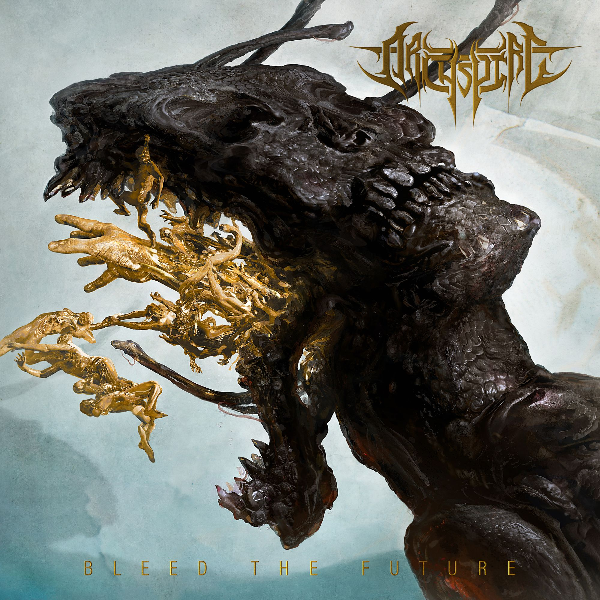
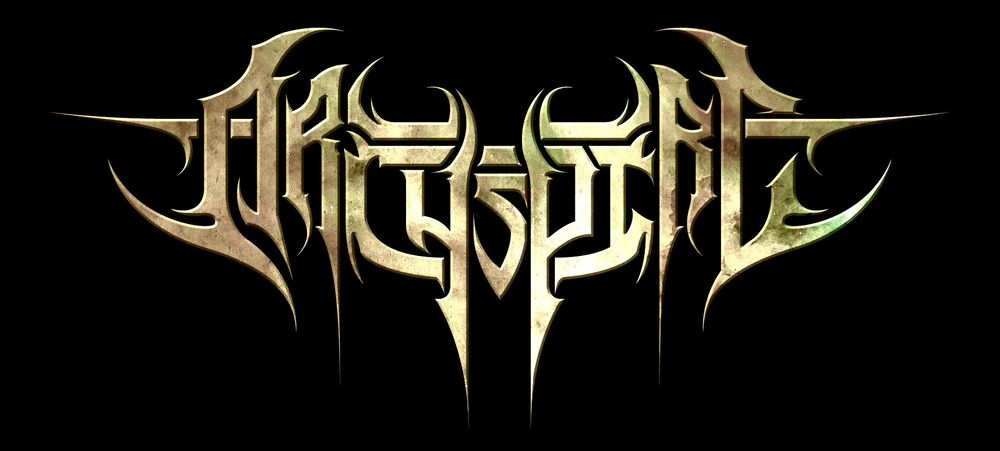
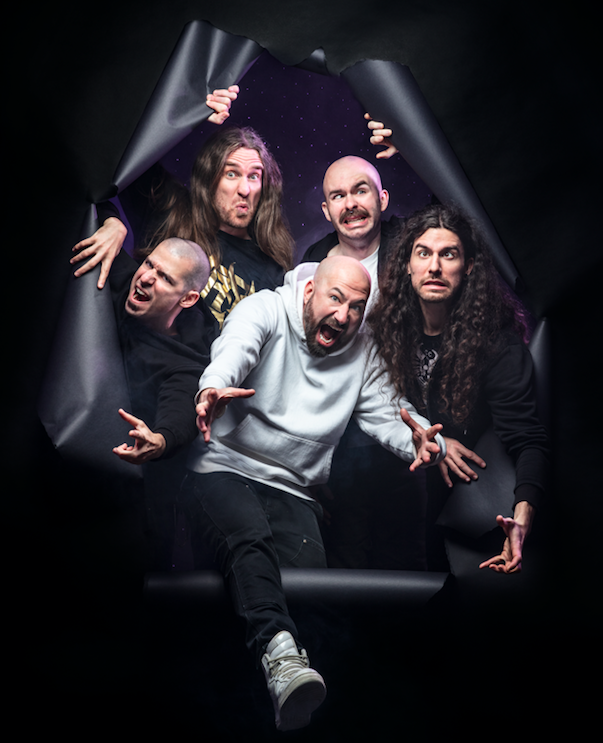

## Bleed the Future

Hello, one and all and welcome back to our continued analysis of the lore and concepts behind Archspire’s discography. Today we’re going to be breaking down the undisputed AOTY, Bleed the Future, but before we do that let’s briefly recap what we learned in the past two records – including a brief look at a potential meta-theme. If you don’t need the recap, feel free to skip forward a few paragraphs (I’ll be sure to cue you back in).

### Recap – The Lucid Collective

I’m not going to reinvent the wheel here – this is a straight copy pasta of the summary from last month. In broad terms, we learned of the Lucid Collective, a group of creatures that have mind-melded into a single, all-powerful entity. Determined to grow in strength and intelligence, the Collective seeks to construct a unified and timeless reality where all are simultaneously alive, dead, and dreaming. We also learned of an artefact, a mimicking mirror, which gained control of the world. Its roots infected the very core of the world and created a portal that bound together 6 parallel dimensions to form the Oblivion Chain. In doing so it consigned the King of an ancient kingdom, the one whose subjects had uncovered the artefact to begin with, to the Kairos Chamber – a timeless hell composed of the King’s own nightmares. Doppelgängers, evil and bloodthirsty aliens made of a black liquid (onyx/the Drip), sprung forth from the parallel dimensions. Once on Earth they seek out and infect people, take control of their bodies, and then proceed to go on murderous rampages.

The majority of the record followed a protagonist, whom we named Blood, a dreamer approached by the Lucid Collective and told there was another person (whom we named Sand) who shared the same lucid dream as he. Throughout the record Blood gradually descended into madness, unable to fathom the infinite depth of matter and parallel dimensions the Collective had opened his mind to, and he was driven to seek out Sand. Blood and Sand merged to create their own new dimension (a shoreline from their dreams), and in doing so they somehow release a monstrous creature (perhaps a doppelgänger) into the world. By the end it even seemed like Blood himself may have become a doppelgänger, such was his madness (e.g. it seemed he brutally murdered his own wife and tore out his still unborn son, who himself became a mutated creature made of teeth).

Now throughout my analysis of the record I was unsure of the relation between the Lucid Collective and the ‘evil’ of the world – namely the artefact and its doppelgängers. Were they opposed to one another or one and the same? Long time Heavy Blog reader Noam (hi Noam!) wrote in saying he felt they were one and the same, with the Lucid Collective selling a dream to lure in new members. Once joined the Collective grew stronger, while the individual could be turned into a doppelgänger – violently projecting their own nightmares into the world. Very interesting take and I can’t help but agree that the Collective certainly seems more sinister than initially meets the eye.

### Recap – Relentless Mutation

In Relentless Mutation we mostly stayed in a single world and dimension. The chief new characters were the mysterious A.U.M., a death cult seeking to take over the world through doppelgängers, the Drip, and flying fucking zombies, and one of its cultists (whom we can call Calamus).

We gained first-hand perspectives of what life was like as a doppelgänger and a remote tumour seeker, though the two could be one and the same. In the case of the former, we had a person who horrifically murdered countless people over the centuries. We also learned of the latter, where one of the brain’s hemispheres is possessed and constantly hunting its opposing hemisphere – not knowing that they in fact share the same skull. Thus, there is an eternal quest for death and destruction that can only end when the remote tumour seeker dies, perfect for a death cult.

The main new plot development from Relentless Mutation centred around Calamus who, at the behest of A.U.M., captured the child of teeth from The Lucid Collective. They were then able to perform human murmuration, extracting bone marrow from the child and using it to reanimate the dead. The dead returned as undead carrion creatures, flying mindlessly in a circle and awaiting the day that they are apocalyptically unleashed upon the world – with A.U.M. intent on killing all that lives.

There were a couple of tracks where we seemed to move into alternate dimensions, worlds, or timelines, namely “The Mimic Well” and “A Dark Horizontal”. The former was an origin story for the Drip. Three aborted, stillborn children (the Siren Triplets of skin, mind, and marrow) were thrown into the Mimic Well. There the Drip was also born, and this is where the Artefact from The Lucid Collective would ultimately be found. It is here that the Drip, doppelgängers, the child of teeth, and senseless murder originated – this is A.U.M.’s inspiration. “A Dark Horizontal” on the other hand was not as clear cut in its interpretation. Here we returned to the dimension of Blood and Sand and, contrary to the evidence that suggests the Collective and A.U.M. were one and the same, we had Blood and Sand (who are a member of the Collective) seemingly fighting against cultists. The cultists’ quest for the artefact was in vain as they met their demise and we were left with a host of unanswered questions.

### Reflections on Relentless Mutation

Once more, I spoke with long time reader Noam and we agreed that the Siren Triplets and the Drip are one and the same, and that they’re symbolic of one of the largest meta-themes throughout the two records we’ve analysed. They both originated together shortly after the triplets were aborted by their mother – in Noam’s words “if you go a bit meta, maybe it’s a commentary on the idea of abandonment, the loss of love for your children, abuse etc. The triplets’ pain is so intense that it spawns the Drip and then they sustain each other in a cycle of self-hatred and pain. It becomes a commentary on the never-ending cycle of child abuse.”

The triplets are abandoned and left to die by the very person that is supposed to love and care for them. The feelings of bitterness, betrayal, and hatred that stem from that moment physically manifests into the Drip. Each of the triplets is individually incomplete – one of skin, one of mind, one of marrow – but none are whole. None are human. The Drip completes them and makes them whole. It allows them to unleash their hatred upon the world. But this completeness is a lie – it is empty and hollow. It can never be filled, no matter how many die, no matter how many skins are taken, no matter how many skulls are ransacked. The Drip is pure toxicity that binds to you, inescapably and forever.

The same is often true in reality. For many, despite their best attempts to become a different person, to become a doppelgänger, they fall into the same vicious cycles of abuse and pain that they grew up in. They are followed by a toxicity that infects not only them, but their relationships as well. It should come as no surprise then that, when reflecting on The Lucid Collective and Relentless Mutation, the most horrible and simply disgusting examples of violence take place between family members – and particularly between children and parents. Think the likes of “Fathom Infinite Depth”, “Involuntary Doppelgänger”, and “The Mimic Well” to name just a few. With this theme in mind it makes perfect sense that A.U.M. is not just some sinister organisation, but a cult – stepping in to fill the void of family. We’re going to keep this context in mind when looking at Bleed the Future, as well as looking out for any new meta-themes that may arise.

Let’s get started – Bleed the Future

Before diving into the new record, the promotional material for the record provided some valuable clues to what some of the key themes would be:

The album is accompanied by a concept developed by Aleron that begs the question: What happens when humans start giving birth to non-humans? Born from a weird dream the vocalist had, Bleed the Future’s concept does not have finality or a conclusion. It does, however, posit a few ethical dilemmas to ties into Archspire’s long-running science fiction themes.

    “I thought about what if those things they were giving birth to could actually benefit them in the future so they wouldn’t want to reject them,” says Aleron. “What would happen to the humans that weren’t born? Would they go to a different dimension? I played with that whole idea because I hadn’t seen a horror movie where that was the theme. It worked for all the songs. The only social commentary is that people don’t know what they’re giving birth to — if you put someone on this planet, you don’t know whether they’re going to be good or evil.”

Just as their interviews helped inform our interpretation of The Lucid Collective, so too will this help us with Bleed the Future. Now, enough preamble, let’s dive in head first!

### 1. Drone Corpse Aviator

    We have seen our enemy
    in the retina on the hill we’re made of
    Peering through the many tortured minds of the imprisoned and the
    grim actions befallen unto them

    We often become blinded
    by the sheer eye wrenching
    defacing of the humans we look into

It feels as if the perspective here is that of an A.U.M. cultist, like those seen in the song’s music video. It’s not clear who the “enemy” is, though non-cultist humans are probably the simplest explanation. The first two stanzas continue the strong ocular themes from the previous records. We hear of cultists observing and judging their enemies, “imprisoned” and with “tortured minds“, harkening back to the likes of “Human Murmuration” and “Calamus Will Animate” where Calamus himself was working for A.U.M. to avoid being tortured by the Drip. Similarly, one could think of the dead he was animating as being imprisoned within an unnatural state.

    We have viewed remotely
    into the homes of every
    sycophantic birthing unit
    They are regretless

    Performing tormenting
    repulsive procedures
    bereft of emotion
    on all that remains of our youth
    that sank from pride to dysentery
    in the wake of the parasitic
    serpent hatching

In the following two stanzas we have the first evidence of what Oli discussed in the introduction, the prospect of humans giving birth to non-humans. A.U.M. have remote access to their prisoners’ wombs (“sycophantic birthing unit[s]”), though whether that is through some kind of technology or whether they have some alien creature (either the Drip or something else) that can report from the inside is unclear. Now from there on things get a lot harder to interpret.

We’re told “they are regretless” – but who are they? The captive humans, their non-human offspring, or what’s left of their human offspring? One would think it’s the captive humans – babies and foetuses can’t have regret. Does this mean the captives are accepting of their fate, and of what they are birthing? Next we hear of “tormenting [and] repulsive procedures”, which presumably A.U.M. are performing on their captives. But here’s the weird part. The procedures are being performed “on all that remains of our youth”. Only a moment ago the cultists were referring to humans as their enemies, yet now they speak of our youth, our children, as if they are on the same side as their captives. Can we just put this down to individual struggle, to a cultist wrestling with their own humanity and struggling for control with the part of themselves controlled by A.U.M.? Is this just another example of Calamus’ feelings, voluntarily doing A.U.M.’s bidding but compelled to record all that is transpiring in a book? Or is there something else at play here?

Either way, the non-human being spawned is some kind of “serpent“, while the references to “sycophantic”, “dysentery”, and “parasitic” all suggest the non-human is a parasite, but for whom? The most logical explanation is that they are parasitic for the humans themselves, but why then would the humans be “regretless”? And how would this reconcile with Oli’s statement that the non-human children were somehow beneficial for humanity? Are they actually beneficial or are we saying the death and extinction of the human race is a boon relative to enslavement at the hands of A.U.M.? We’re barely 40 seconds into the record and already we have more questions than ever before.

    With their hypnotic immunity
    execute the vile deed
    Watch as they feed them
    hair skin teeth and cartilage
    Digging deeper
    Now we view the buried dead

    We shall crawl
    into the marrow of their corpses
    Make them fly and navigate them

These two stanzas, separated by a short bass solo of sorts, are delivered in rapid-fire staccato bursts alongside a breakdown section of sorts with the machine-gun double kick we’re accustomed to, thick rhythm tones, and neck-snapping pinch harmonics. It almost feels like the narrative here is completely separate to what we’ve seen before. Here, we’ve well and truly been transported back into Calamus’ warehouse as cultists inject marrow from the Child of Teeth into the “buried dead”, reanimating them as undead carrion. The only way to potentially reconcile this with the previous passages is if the “vile deed” is the birth of non-humans, the mothers then continuing to feed them as A.U.M. look to turn what’s left of their human babies into zombies. But that seems a little far fetched, even by Archspire standards.

After a short solo, we then hit the song’s main melodic refrain. An absolutely gorgeous, neoclassical, and melodic guitar composition wraps us in a loving warm blanket after the balls to the wall opening. This is right about the time in the music video that a special cultist, perhaps Calamus himself, takes centre stage and starts melting faces and detonating heads. Fittingly, then:

    With our weave of blackened liquid
    we will wake the resting rotted

    We will clear and light the path
    of all that have arrived before us

    Through the sirens of the drifted
    vacant dreaming and awaiting
    that lay dormant in the earth

    Drone Corpse Aviator [x4]

Here we have a little more detail into what was happening in the human murmuration described in Relentless Mutation. The Drip is injected into dead people, lending A.U.M. control of their zombie forms, and allowing A.U.M. to become “drone corpse aviator[s]”. Aviator is a very active term, conjuring images of a little pilot inside the zombie’s head taking control of everything, and this comes off the back of “we shall crawl into the marrow of their corpses” from a previous passage. Whether this is just metaphorical language, and in fact A.U.M. is doing everything remotely and via technology, or whether they quite literally have tiny alien agents (the Drip or otherwise) on the inside actively taking control is debatable. I probably lean closer to the latter here, with the Drip essentially a creature unto itself once it has entered a person’s body – whether they’re alive or not. We also have some nice tie-ins to previous concepts, like the Siren Triplets and the trinity of death, life, and dreams.

After a solo we then have a slight lyrical twist on the chorus of sorts that we just looked at, with the neoclassical melody coming back into the fore and carrying much of the track’s musical momentum.

    Within our weave
    we hold a well of black liquid
    and with it we will wake the rotted
    from their resting fields
    With our path now lit we can travel
    to the aftermath of our captors entrance
    Through the sirens of the drifted
    that lay dreaming under the earth.

    Drone Corpse Aviator

The line that stands out here is “we can travel to the aftermath of our captors entrance”. Again, given we believe the narrator a cultist is this the official perspective of A.U.M.? If so, who has captured them? Or is this the human side of the cultist speaking, describing themselves as a captive of A.U.M.? Perhaps more importantly, what is the aftermath of their entrance? If A.U.M. is the captor, is their entrance a physical location – a headquarters of sorts? Or are we again dealing in metaphors, such that their entrance represents their entry into this world and this dimension? If that is the case then the aftermath is bleak indeed, given their zealous pursuit of apocalyptic murder and destruction.

The remainder of the track is batshit crazy instrumentally, as guitars and bass fly along at a frightening pace amidst gravity blasts and Oli’s trademark vocal delivery. However, lyrically we don’t seem to learn a great deal more (though I’ll post the lyrics below for completeness), as we have various descriptions of the undead army A.U.M. have accumulated. It appears they are ready to fly and ready to fight for their masters – so humanity had better watch out.

    We shall crawl
    into the marrow of their corpses
    Make them fly and navigate them

    They will move and yell and fight again
    but not from breathing
    they will return
    Taking to the air in droves of gliding carrion
    Piloting the many flying
    with the pull of tar in marrow

    They will move and yell and fight again
    but not from breathing
    Not alive but ridden from the burrow
    they will return
    Lifted out of every monument
    they put up in their honour
    All the dead they buried
    now propelling in our flying pattern

    They will move and yell and fight again
    but not from breathing
    Not alive but ridden from their burrow
    they will return
    Taking to the air in droves of gliding carrion
    Piloting the many flying
    with the pull of tar in marrow

    Shifting in formations
    that are unknown to humans
    We’re blacking out the air
    with decomposing gliders

    We shall crawl
    into the marrow of their corpses
    Make them fly and navigate them

### 2. Golden Mouth of Ruin

    Rearranging time
    in the glaring Golden Mouth of Ruin
    We reenact the life
    Boanet precreates in their glowing gape
    Their dislocating bite
    to become the law of all our endeavors
    Gutting our belief to reel us
    Everyone of our memories gone

Ok, now definitively we’re moving past the storylines of the past two records and into brand new territory. Because concept albums are too say to analyse otherwise, we have to deal with “Rearranging time” and potentially Kairos – so who knows whether this is taking place before, during, or after the events we’ve covered over the past few months (or all of the above). Just as eyes and vision have been a key motif throughout the records, so too are mouths here. The capitalisation of the “Golden Mouth of Ruin” suggests we’re dealing with a specific physical thing, much like the Mimic Well for example.

“Precreates” is an interesting word. I’m not sure if it’s a typo and meant to be ‘procreate’, given that it is not in the dictionary. However, some websites claim it to mean ‘To create in imagination before the event; create before (something else occurs).’ Boanet certainly seems to be a new character. The narrator here looks to “reenact the life Boanet precreates in their glowing gape”, so we certainly have a lot of time rearrangement already. They are reenacting some life, which presumably has already happened, but the life they’re reenacting has been precreated – so does not exist yet. More importantly, whose life are we talking about?

The “dislocating bite” may also be a play on words, referring to location and space, suggesting that both time and space may not obey the usual laws we’re familiar with. The new “law of all our endeavours” seems to be Boanet, and Boanet’s jaws seems to be the “Golden Mouth of Ruin”. Much like we see with A.U.M.’s cultists, the narrators here have lost their memories – indicating that Boanet is perhaps at least as powerful as A.U.M. if not an agent of A.U.M..

    Bow unto the Boanet embracing our defeat
    To the new path they implant we are tied

    A.U.M. digging into me
    said to record our every vision
    taken out of the gold mouth of our after
    For they have spoken with the neo born
    we now know as the Boanet
    Building it a lair
    out of brick mud and all our hair
    Digging wells to house our seed

The first stanza here reinforces Boanet’s power, while the second reveals the identity of both the narrator (kind of) and of Boanet (most definitely). The narrator is possessed by A.U.M., either a cultist or a prisoner, whose every vision is being recorded. Boanet is the “neo born”, the serpentine non-human child the record is focused upon, and A.U.M. has made contact with them. More than that, the cult seems to be directing its subjects to help Boanet by building it a lair. The final line is ominous, suggesting a breeding program of sorts is looking to be established.

    Disintegrate the carotid barrel
    in our ever grinding wheel of meat
    we were forced to ingest
    in the tooth round gears of our past
    Now blood led we devour
    all that ripen from their will to create

    We now begin the crawl
    The ritual it embedded in our brain
    to make it open
    We kneel around the well
    In the room we allocated at our home
    to be an altar
    We grind the skin against the brick
    until we see the white of bone
    behind the red
    We etch in the brick with its skeletal chalk
    the name of the child that we’re grinding
    to harvest

The narrator seems possessed and crazed, much like Blood from The Lucid Collective and the doppelgänger from Relentless Mutation. The first stanza is particularly difficult to comprehend with its mechanical metaphors. We’re told of wheels, gears, and (mechanical?) teeth – perhaps symbolic of the machine-like precision of Archspire’s music A.U.M.’s operations. It’s not clear whether the ingesting into teeth is metaphorical or literal, for example via injection of marrow from the Child of Teeth. Harder still to understand is what the gear of their past could mean. But whatever it is – the narrator seems to have a doppelgänger’s zeal for violence in the aftermath.

Things become a little clearer in the second stanza. Here we see these people moving to the cultish altar in their homes, kneeling around the well which houses their seed. Perhaps these may be imitations of the Mimic Well, given the similarity between the doppelgängers and the narrators and how the origin story of the triplets is also closely linked to the well and to birth. Here the narrators describe how they “harvest” another victim in the name of A.U.M..

    Clipped Pulled Cut
    With tooth and nail now ground to dust
    we open it
    We fed it now we wait until the gold

    Leaning over blood and brick
    we coat around the teeth of it
    The powder that we grinded up
    will make the Boanet reopen

    Biting its own fleeing tongue
    to fill it’s mouth with a pool of living gold
    The pond of glowing alloy
    that you look into will now begin
    to cast your new life

The victim’s teeth and nails are ground into a powder and fed to the well, which seems to also be a mouth. They refer to it as Boanet, though perhaps Boanet can be in several places simultaneously – it seems highly unlikely such an all-powerful creature would simply reside in a home and serve as an altar. The mouth/well takes the powder and fills with “a pool of living gold” – and the narrators seem to be able to use this to start a new life.

    Disintegrate the carotid barrel
    in our ever grinding wheel of meat
    we were forced to ingest
    in the tooth round gears of our past
    now blood led we devour all that ripen from their will to create
    Now blood led we devour
    all they will to create

    A.U.M. digging into me
    said to record our every vision
    taken out of the gold mouth of our after
    For they have spoken with the neo born we now know as the Boanet
    Giving them the power
    to conduct the afterlife
    beyond the new world they’re creating

    We were forced to ingest
    in the tooth round gears of our past
    now blood led we devour
    all that ripen from their will to create

    In the Golden Mouth of Ruin
    Rid the young of all their teeth

While much of this passage is repeated from earlier in the song, the second stanza is very revealing. A.U.M. have vested in Boanet “the power to conduct the afterlife beyond the new world they’re creating”! So it seems clear then that A.U.M. and Boanet are very much aligned with one another and an afterlife is consistent with the disparities in space and time referenced elsewhere in the song. It’s almost as if A.U.M. have created their own Underworld, plan to send all of humanity to it, and have appointed Boanet as their resident Hades. If we continue to assume that A.U.M. and the Collective are one and the same, or at the very least closely connected, then this also ties into the meta-theme of child abuse and suffering. The cycle of pain and violence doesn’t even end with death. That is not sufficient for revenge – the torment must continue into the afterlife too.

The final line is likewise consistent with what we’ve seen before from A.U.M., searching for teeth in order to create more drone corpse aviators and doppelgängers. We then return to the opening verses of the song, before closing with some chugging riffs and the final new lyrics:

    Reenact what they reflect
    inside the Golden Mouth of Ruin
    Grip of time defied
    in the glaring Golden Mouth of Ruin
    in the glaring Golden Mouth of Ruin

### 3. Abandon the Linear

Ahh yes, more of what the doctor ordered, it’s time to “Abandon the Linear[ity]” of time.

    Casting in reverse
    Reeling from below
    Baiting with a cure
    of indefinite forward
    Pre-empting
    Independent thought

    Floating in their multilateral current
    of artificial living
    Spawning in their pond
    of expedited mortal sequences
    An inherent draw
    to their synthetic prosperity
    lures us to their hook

Ok, shit’s getting weird here. We’ve got a lot of fishing metaphors here and, as a reader (hi Schuyler :)) pointed out to me last week, this ties in quite neatly with what another reader (Noam) had pointed out last month. Noam felt that doppelgängers and the Lucid Collective were one and the same, with the Lucid Collective selling a dream to lure in new members. One could similarly argue that A.U.M. would find it easier to bait the disillusioned or abandoned into joining their ranks – and these metaphors extend neatly to the opening stanza here. Whether it’s A.U.M., the Collective, or Boanet – manipulation is central. A “pond of expedited mortal sequences” is the most thought-provoking line here. While its meaning is still far from clear, some contenders include the Mimic Well or something akin to the River Styx.

    Making effect of all action
    appear former to the cause
    to conceal their capability
    to reconfigure time

    Abandoning the Linear
    Past awareness to the unknown
    Reverting all consciousness
    to nothingness
    to emptiness

    Terminating thought and feeling
    Falling toward the never ending
    in a state of savage bliss
    Insentient and laughing up blood

    We named it Boanet
    honoring the first one to birth it

Here some of our earlier uncertainties begin to be resolved. We’re talking about some entity with complete control over time (“capability to reconfigure time“) and thought – it can revert “all consciousness to nothingness” and “terminate thought and feeling”. Certainly sounds like an entity related to A.U.M., and sure enough, it’s none other than Boanet – named so after its mother. Interestingly though, we’re told they’re named in honour of “the first one to birth it” – which implies there are many of them, for there must have been more than one birth. So Boanet may be a species, a type of creature, rather than some individual thing. Chillingly, the narrator seems to be in some kind of eternal hell, their very own Kairos Chamber. Falling forever, with no thought or feeling, “insentient and laughing up blood“.

    They came here from out of the unknown
    Arriving on our planet
    by replacing human birthing
    Teleporting from the dilated portal
    in between the femurs
    of the half that used to breed us
    Timelessly we all await the wonder
    in the mouth of our new creature
    Sacrifice the old offspring
    to our serpents ones
    Looking in their glow while in the crawl
    to track our kin to feed them
    Laughing up blood

    [stanza x2]

The first half of this stanza describes the arrival of Boanet. Crucially, we’re told that women “used to breed us” – which implies human children are no longer being born. These serpent children, Boanet, are then like pagan gods requiring sacrifice – children are sacrificed to them, entering their Golden Mouths of Ruin and (again) laughing up blood (what an image). After largely repeating an earlier verse we then have:

    Hunting
    Ripping us out of the membrane separating two worlds
    colliding into one another
    Punctured
    With our bite there is relief in being taken
    Lash till death
    against an unimaginable landing
    Suffocating in their foreign color spectrum
    Blinded
    Fixated in awe
    by what our eyes could never process
    Alleviating every alerted nerve

Here things become a little more cryptic. Up until now it seemed like we had a human perspective. If we follow that thread, perhaps we’re following the perspective of the human babies that are no longer being born. Maybe they have gone to another dimension, into some “membrane separating two worlds”, only to be dragged back to be sacrificed. Yet, the narrator seems to be the one biting (“with our bite”) – isn’t Boanet the one with the Golden Mouth of Ruin? Finally, the final few lines take us all the way back to The Lucid Collective as the protagonist seems to be struggling to “Fathom Infinite Depth”. We then cycle back into the ‘chorus’ (“Abandoning the Linear…Terminating thought…”) and a lovely guitar solo before concluding with:

    Inherent intent take control
    of our conscience
    Growing at a pace they contort
    to conform us
    Fallen like the many other
    forms of coexisting live had
    victim to their birthing pillage
    Endangering every cognitive race
    they can find while in hyper travel
    in any realm infiltratable
    and parallel to their own
    that exuded reproductive capacity and awareness

    Fade into the never ending
    Insentient and laughing up blood
    Confront innate decay
    Fade into the never ending
    Embrace eternal rot
    Confront innate decay
    Insentient and laughing up blood
    Embrace eternal rot
    All rational thought exterminated

It seems we’re very much tracking the Collective here. Boanet seems to be just another tool in their armoury, alongside the Drip, as they set about “Endangering every cognitive race they can find…in any real infiltratable… that exuded reproductive capacity and awareness”. Humans aren’t the end, they’re just the beginning. The Collective seem to be executing inter-dimensional genocide at a universal scale. Our protagonist, like Blood and Calamus before him, seems to have succumbed to their might – as the three concluding lines attest.

### 4. Bleed the Future

    Before anything expelled breath
    upon the earth
    Boanet had formed.

    Seething between any of the worlds
    that supported pumping vein ridden lifeforms for them to feed on
    Gold blood
    Breeding any life will light a beacon
    Leaching through the womb
    of any creature
    Latching onto anything in utero
    and trading them
    with every living human newborn
    Grown in each ripe host undetected
    Gold blood courses inside
    the parasitic mouth

    They will take us now

So now our warped sense of time is REALLY kicking into overdrive. Boanet predates life on Earth! In earlier songs we’ve had a lot of references to blood, “carotid” arteries and the like – life sustains Boanet, it feeds on it. Yet, it can also exist “between any… worlds” – perhaps in some other dimension – until conditions are ripe for it to physically manifest. Any form of life will “light a beacon” – alerting Boanet. The last time we heard about beacons was “Involuntary Doppelgänger”, where it was the means of communication between doppelgängers and A.U.M.. Boanet then somehow finds its way into the uterus, parasitically trading places with unborn humans. At a more meta-level, each of the songs so far seems to be from a human perspective, and someone with close ties to A.U.M. at that. Could it be that the narrator to each song is in fact the same person? Could it be that Calamus is our chief protagonist and we are reading the notes he was taking in Relentless Mutation, documenting all that was transpiring?

    One could not escape the bind
    of that which could bloom and feed
    inside the birthing caverns
    of their own kind
    They grow we die

    You would think that what they were
    and what they wanted
    would’ve mattered
    yet the many fell
    under their pliable delineator

    Seething between any of the worlds
    that supported pumping vein ridden lifeforms for them to feed on
    Gold blood
    Breeding any life will light a beacon
    Leaching through the womb
    of any creature
    Latching on to anything in utero
    and trading them
    with every living human newborn
    Remaining undetectable
    up until the final foetal breach
    Gold blood courses inside
    the parasitic mouth

The first stanza summarises where we’re at. There is no escape from Boanet. “They grow we die”. “They” again suggests multiple physical entities for Boanet, though whether they’re separate individuals of the same species or simply multiple physical manifestations of the same entity is unclear. The second stanza seems to refer to humanity’s widespread acceptance of Boanet. Despite the horrors they were, despite the horrors they intended for humanity, “pliable” humans accepted their fate. The third stanza largely repeats an earlier verse, only now we learn that Boanet remains “undetectable up until the final foetal breach” – the hosts cannot know until it is too late.

    Nothing ever written
    could define the global hell to follow

    Prenatal inquiry
    during its trimester sentencing
    could not begin to uncloak the new lifeform that gnaw on the humans umbilical feed while it
    soaks in the swell of the host

    A Parallel dimensional metamorphosis
    immediately triggered
    by the scent of our realm.

    Claiming and leading our young
    into forced abandon

Alongside some added description of Boanet’s secrecy and parasitic nature, we learn with certainty what we had earlier suspected – that Boanet is of a parallel dimension. Further, it seems they have led humanity’s young “into forced abandon” – could this be the driving factor behind the Siren Triplets? Perhaps their mother, rather than give birth to Boanet, chose to terminate the pregnancy. Perhaps Boanet has indirectly given rise to the Drip!

    Bleed the Future

    On arrival
    there is a shift in the voice of the witness
    The future is bled
    There is a cloud that forms
    over the eyes of the birther
    when from the deep the creature is born

    Within their blood they create
    they will alter the end of the end.
    For in their mouth the future is made.
    If in the glare of their gold
    we burn our eyes
    look again look again
    for in their blood a new path awaits

    Within their blood they create
    they will alter the end of the end
    If in the glare of their gold
    we burn our eyes
    look again look again

The song’s crescendo sounds prophetic in its lyricism. Boanet is time incarnate. Its golden blood is the future, bleeding out of women the world over both literally and figuratively, as the future of humanity is doomed without human newborns. Boanet will dictate humanity’s future, its path, its fate. We return to some previous verses before concluding with one of the most impactful verses of the record, a verse that simply says it all:

    Gold blood
    Animated into matter
    Taking over the entire planet
    with a foreign power
    they inherently developed over many eons in a battle to consume our kind
    The future is bled
    The future is born
    The future is gone

### 5. Drain of Incarnation

    When the trade had happened
    they could barely notice
    Acting undefeated
    as if the breed were their own blood
    Getting integrated
    with the knowledge of it
    as they feed it on enamel nail and bone
    I can tell you confidently
    that whatever you believe in
    you would throw it all away
    and beg a God in any heaven
    to rid your brain of how it feeds

    Taking the place of us
    Our kind made to grow into
    Ignis Nativitas
    Hatching to immolate
    Newly woken lit on fire
    Many of them enter
    mended all together
    Burning in a whaling altar

After a quaint and melodic introduction, focused on drum and bass with a distinctly Machine Head melodic flavour, we hit the song with probably the fastest vocal work we’ve seen from Archspire to date. Again, we have the language of trading Boanet for unborn humans, implying that the human babies have gone somewhere – perhaps to whichever dimension Boanet occupied before life on Earth. The opening stanza mostly reiterates the horror of Boanet and the total success of its secret and parasitic infiltration.

The second stanza offers some hints as to where those humans are heading. While google translate insists Ignis Nativitas means Fire Christmas, a more accurate translation seems to be born of fire. The religious connotations here, with references to God and Nativity, perfectly carry over to a traditional Christian concept of Hell – with the baby humans “lit on fire… mended all together burning in a whaling altar”. Whether this is in some other dimension, in the wells described in an earlier song, or in the Afterlife Boanet presides over is yet to be made clear.

    Defects erupt from the bowers
    competing without cause or intent
    for a chance to live

    Riding up the root of rotting
    intertwining infant limb and natal liquid
    leaking out of every tunnel
    in the blackened multitude
    of ever growing living yelling tar

    …

    Hatching to immolate

    In the Drain of Incarnation [x2]

The first two stanzas, wrapped in metaphors of foliage and trees, are difficult to decipher beyond the fact that the Drip seems to be on the scene now. Thus, the Drip and Boanet seem to be more closely related than perhaps we had previously thought to be the case – could they potentially be different manifestations of the same entity? Is the Drip here infecting the unborn babies that have been sent away, or is it focused on the humans still on Earth? The final line, vocalised with tremendous emphasis, tells us where the unborn children have gone, what the name of hell is, the Drain of Incarnation. Perhaps the well that served as a cultist’s altar in “Golden Mouth of Ruin” was in fact the Drain of Incarnation.

    Ripped from the scape
    Peeling off like bark and floating
    around the wreath
    of terminated incubation
    Drawing inward
    Taking with it all the rotting fruit that fall
    in and around it
    in a violent cyclical Drain of Incarnation

    [Chorus]
    Boanet
    Grown and fed had taken flight
    to our world
    Riding on the reveries
    of the unborn and dreaming young
    Futile and undefined
    Minds thrown
    on the track of banshee talon

    [chorus x2]

The tree metaphors continue in the first stanza here, and again it’s not clear what is happening beyond more aborted babies ending up in the Drain of Incarnation. After a solo we then get two repetitions of the second stanza, which is essentially the song’s chorus. Perhaps Boanet is also the Collective? Like them it is all-powerful, capable of interdimensional and interplanetary travel, and its power grows with dreams. Boanet is perhaps best imagined as a dragon now, given it’s a serpent, capable of flight, has a Golden Mouth of Ruin, and is altogether associated with gold. We also have a reference to banshees, which were also briefly mentioned in “Calamus Will Animate”. Banshees foreshadow death. This further emphasises the link between Boanet, whose arrival marks the death of children, and the Drip, which was used in “Calamus Will Animate” to bring victims back from the dead. Boanet’s name also brings to mind a boa constrictor, a non-venomous species of snake. The Drip is synonymous with venom, and Boanet may represent the opposite side of the same coin.

    Torn under claw in the wake of their flight

    They manipulate the venom
    flowing in them to eliminate us

    Spiraling into the Drain of Incarnation
    Into the Drain of Incarnation
    The pulse of the tide rip our remains
    forever into the Drain of Incarnation
    [stanza x2]

    [Chorus x2]

    Taken by the pull of tide
    into the Drain of Incarnation
    Riding on the reveries
    of the unborn and dreaming dead

This song is the first time that dreams have had a prominent role, reinforcing the overall concept of the trinity of death, life, and dream. Here it is the unborn that embody this: they dream, they are dead, yet they still exist within the Drain of Incarnation, they still live. The most puzzling lines here are the opening ones, that “They manipulate the venom flowing in them to eliminate us”, which suggests the Drip flows through Boanet. This seems inconsistent with what we’ve seen before, but perhaps more will be revealed in the final three tracks.

### 6. Acrid Canon

    The thought of bringing to term
    this thing growing within
    elevates my disgust
    to a crippling wretch

    Feeling it crawl into me from the void
    is beyond gut wrenching
    it’s beyond anything
    one could have dreamt
    or created fictitiously

    Can you control what can not be killed?
    What is to become
    of my imminent new born

For perhaps the first time in the record, it feels like we have a vastly different perspective, one that is not aligned or affiliated with A.U.M. or any of its related horrors. Instead, our protagonist (whom we will call Mother) is pregnant with Boanet and describes in visceral detail the horror of such a thing. This is also the first time there’s been any form of recognition from a human that they are in fact carrying Boanet rather than a human child. We also circle back to the theme Oli mentioned at the outset of this piece, namely the question of “Can you control what can not be killed?” and what is happening to unborn humans.

    Taken to a room by gurney
    Examined under fluorescent light
    Everything I witnessed after this
    I documented in my Acrid Canon

    Taking mental note of all the horrors happening around me
    to scribe down
    while amid the massive havoc

    After my eyes tamed to the light
    I surveyed the room
    and saw the abnormality

    Crowning out of the person expressionless
    spread next to me
    I vomited out of fear

    Hazmatted men now fill the room
    Gathering around the bed
    admiring a four foot coiling gleaming slug

The first-person perspective and narrative structure are very clear and easy to follow here. Mother has been captured by A.U.M. and taken to a room to give birth (one might even call such a room a “sycophantic birthing unit”). She is determined to record all of the horrors that she witnesses in a document, in an Acrid Canon, much like Calamus before her. While waiting she sees a fellow woman give birth to Boanet, the sight of a “four foot coiling gleaming slug” causes her to vomit.

Given Boanet’s otherwise serpentine descriptions, perhaps they only appear slug-like when first born? Alternatively, perhaps Mother’s recollection is far from perfect given the traumatic circumstances. The reason this is interesting is because we’ve heard of one slug before in our analyses, namely in “The Plague of Am” from The Lucid Collective. That track was based on Harlan Ellison’s sci-fi short story I have no mouth, and I must scream. There, Allied Mastercomputer (AM) took the place of A.U.M. and/or the Collective and/or the Drip: an omnipotent and evil presence whose sole purpose was to inflict death, destruction, and torture upon the world.

AM destroyed most of humanity, but left a handful to toy with – turning Earth into its very own Kairos Chamber in which it could levy eternal torture unto the survivors. Finally, the survivors realised their only escape was death and they began killing one another. All died save one, whom AM caught before they were able to commit suicide. This sole survivor was then turned into a slug, a creature that could not kill itself, a creature that had no mouth, but needed to scream.

So what is the parallel here? Well, Boanet is unlikely to represent the slug from “The Plague of AM” as it’s aligned with A.U.M., rather than against it. However, while the roles may not align the overall themes certainly do. Mother is trapped, just like the survivors of AM. She must scream. She is powerless. A.U.M., like AM, weren’t content with simply killing humans with doppelgängers and drone corpses. No, they decided to have Boanet preside over the afterlife too, over the Drain of Incarnation, to impose eternal punishment and torture. Returning to the meta-theme, again it emphasises that there is no escape from the torture that is childhood trauma, abandonment, and abuse.

    Blacking out from what I witnessed
    Waking up and wondering
    if what I saw was real or faked
    or some kind of a sickly fever
    The man hovering above me
    told me I was close to hatching
    Peering around the room again
    I saw the gore that proved it happened

    Morbid visions
    repeating again and I vomit in fear

    My throw up made the man recoil
    enough for me to run away
    No relief from my escape
    The town just bore more fodder
    for my Acrid Canon

    Along the stretch of road before me
    far as any eye could see
    Children strung from poles and scalped
    Their skin and hair had been removed
    Around their neck they wore a sign

    Freeing the first that I could
    caused them to scream
    alerting their harvesters
    Pliers and scissors in hand
    the elderly ran
    towards me in multiples

    Bolting into a near idling vehicle
    They chase me faster
    than humanly possible

We’ve said it before and we’ll say it again: what kind of fucked up dreams is Oli having? Courtesy of tactical vomiting Mother is able to make an escape from the A.U.M. compound. Unfortunately, things only go from bad to worse once she leaves. Still heavily pregnant with Boanet, she sees children crucified along the road as far as the eye can see. Their skin and hair have been completely removed – presumably to feed Boanet and the Golden Mouth of Ruin given the consistent references to feeding on hair and enamel. In trying to free one of the children she inadvertently alerts their “harvesters”, forcing a desperate run and escape into a nearby vehicle.

    As I rode away I looked down
    at the sign the child wore
    that stuck to me with clotting blood
    I peeled it from my chest and read it
    “Write the name of what you feed it
    in the chalk made of their bone
    on the brick where it lay dreaming
    and see your future”

The sign describes what we had observed in “Golden Mouth of Ruin” – instructions for cultists to be able to see their future. The track then concludes with Mother writing her Acrid Canon before tragically having Boanet force its way out of her.

    Panic breathing
    I can feel it
    crawling in me
    Breaking my water
    I grab a pen and as I fade
    I write the burned in memories
    of my Canon
    Acrid Canon

    I pound on the horn
    and beg not to give birth to it

    This thing is in me
    The Boanet’s growing
    The creature is in me the Boanet’s growing
    The Boanet’s growing
    The Boanet is coming out

### 7. Reverie on the Onyx

    Hack into a light
    fading out then in
    can it light again?
    Gone yet still here

    I can feel the pull
    Them and I are one
    Never to unbind
    Dead and tethered

    I get into the eye of our collective
    I liquidate
    and crawl atop the mound of many
    Melting to attain ultimate vantage
    I guide the many
    to the light that I can take in

There are several possible interpretations for this song. First, the perspective is at times similar to that of “Drone Corpse Aviator”, where we suspected the narrator was an A.U.M. cultist. Second, it could be from the perspective of the unborn human children who have been melded together in the Drain of Incarnation. Third, it could be a personification of the Drip or of Boanet, in a way describing the record’s cover. Under this interpretation each of the gold figures is like a component of the Drip or of Boanet, working together from the inside of their host to transform them into an alien creature. We’ll be working under this assumption, and interpreting the opening verses as the beginning of a relentless mutation.

We can imagine these little golden creatures within their host, working their way up from the uterus towards their head. Aiming to take control of their host’s mind, eager to rip through their head and see the daylight, before stitching them back together in their alien form.

    I take in the breathing undead sky
    Orienting all of the boneless unripe breed
    how to latch on to the inside of my eyes
    when I see our dead dreams
    alive and expanding
    In Reverie on the Onyx Landing

    Take the breathing undead sky
    Orienting all of our boneless unripe breed
    how travel into my view
    to see our dreams that died
    return to us upon the peak
    In Reverie on the Onyx Landing

Upon completing their transformation, our new doppelgänger / drone corpse / Boanet / alien creature sees the sky littered with drone corpses, with undead carrion. The end times are upon us. “In Reverie on the Onyx Landing“ suggests that it is indeed the Drip that we are focusing on here, tapping into the Collective’s dream world as we again have the unification of life, death, and dream. Whilst the song continues for several further verses and another iteration of the chorus, the meanings seem to largely reinforce that which we have already considered. This leaves us ready to tackle the final song of the record and bring this monolithic exercise to an end.

### 8. A.U.M.

    Is it better to be gone
    then remain alive here
    just to track their ethos?
    If I bled myself out till death
    I’d still hear them
    If I were to withdraw my breath
    cower back to the dirt
    my mind would still run
    for all Apeiron
    It can navigate my body
    if I ever tried to give up
    They commandeer my every atom

    To document everything
    even though they never read it
    Written beyond a human speed
    in ink or blood with hands and feet

We’re wrapping up with the shortest track on the record, but at 400bpm it’s also the fastest song of Archspire’s career. We kick off with a hilarious voicemail, starting with the quip “what’s this music about?”. GREAT question good sir, maybe somebody can find that man and link him this! Anyway, Oli proceeds to “bring back the fucking danger” with the fastest extreme vocals you’ll likely hear.

The perspective seems to have reverted to either Mother or Calamus – someone that is documenting all that is transpiring. Interestingly though, this time they’re documenting things not of their own volition, but at the behest of A.U.M. directly. They’re under A.U.M.’s influence and control – which harkens back to a key theme on Relentless Mutation, that of control. How much control does the host have vs the parasitic alien? Again we’re told that death, dream, and life are one, for even death cannot save our protagonist from A.U.M., their “mind would still run for all Aperion [infinity]”.

    I woke up here surrounded by the others
    Gazing at the black
    erupting from the ceiling
    The A.U.M. had rid our eyes of lids
    so we could view
    the inverted volcanic peak
    of molten figures
    Laying in the venom I can feel them
    take the part of me they want

    Giving into fear will only feed them
    I let them into every thought
    The drip my mind and A.U.M. become one

Here, we have another trinity of unification: “The drip my mind and A.U.M. become one”. They are possessed, they are a doppelgänger. Once again we have a reference to the front cover, just as we did on the previous song, the “molten figures laying in the venom” and orchestrating the possession. Our protagonist doesn’t resist, for they know that will only make it worse, allowing themselves to become one with them. We then end with:

    Apeiron Universal Migration
    Captivating leek of all their vitriol
    I integrate in category

    …

    They commandeer my every Atom
    to document everything
    even though they never read it
    Written beyond a human speed
    in ink or blood for all Apeiron

At long last, we learn what A.U.M. means! Apeiron (i.e. infinite) Universal Migration. If there had remained any doubt, surely that has now been eviscerated – A.U.M. is the Lucid Collective. An exciting way to cap off the record, but as always we’re left with a lot more questions than answers.

How exactly does Boanet relate to A.U.M.? What is the purpose of having Boanet, doppelgängers, and drone corpses – surely doppelgängers alone would have been sufficient? How does anything from this record imply that Boanet, that humans birthing nonhuman creatures, is in any way a good thing – as suggested by Oli at the outset of this article? What really are the Drain of Incarnation and the Mouth of Golden Ruin, and what has really become of the unborn humans?

Now, before we wrap up, after I’d written this piece but before it went live I learned of this awesome interview between Rekt Chords and Oli himself. I didn’t want to distort my original interpretation by going back over and editing it, but below are some revelations Oli shared and how that influences our analysis.

On Bleed the Future, the women of earth begin giving birth to reptilian creatures called Boanets – and no one seems entirely phased by this happening.

    “The basic concept came from a dream that I had,” says Aleron. “I was trying to reverse-engineer how something like that would happen, how would people not be freaked out by this? In the dream, the creatures would bite their mouths, which would fill up with golden blood. And people could look into these pools of blood and see into the future. So the parents are basically hypnotized by these creatures because they allowed them to see into their futures. The human children that they previously had, are being used to feed these creatures.”

    “There are a couple of parallel stories running at the same time,” says Aleron. “The A.U.M. cult find supernatural forces around the earth and try to harness them in their laboratory. Basically, A.U.M. is trying to use these creatures to their own benefit.”

So this helps answer a few of our earlier questions! A.U.M. appear to be using Boanet as some kind of tool, which is perhaps why they were trying to have births taking place in their laboratory (e.g. “Acrid Canon”). It also explains some of the inconsistencies we’ve seen between A.U.M. and the Collective – they often seem to have the same goals and use the same kind of powers (e.g. the Drip), but they do appear to clash at times (e.g. “A Dark Horizontal” from Relentless Mutation).

The biggest thing we missed thoughout was the hypnosis element. Suddenly, some of the songs begin to make a whole lot more sense, like “Drone Corpse Aviator” (“with their hypnotic immunity”), “Golden Mouth of Ruin” (“every one of our memories gone”, “To the new path they [Boanet] implant we are tied”, “Reenact what they reflect inside the Golden Mouth of Ruin”), “Abandoning the Linear” (“Terminating thought and feeling, Falling toward the never ending in a state of savage bliss, Insentient and laughing up blood”, “Blinded, Fixated in awe“), and of course the title track (“If in the glare of their gold we burn our eyes look again look again“) just in the record’s first half alone.

Hypnosis also ties in perfectly with A.U.M. being a cult, as one could argue that cultists have ostensibly been hypnotised by cult leaders. While a bit more of a stretch, the Collective can be tied in as well for each member becomes individually mindless to further the collective hive mind. In any case, these entities all share tremendous commonalities in the way they use power and manipulate those around them to achieve their ends.

If you think I’ve missed something or you have a different interpretation or theory be sure to leave a comment or get in touch – I’d love to hear it – and a huge thanks to those who have already been in contact!. And so, after three parts and around 25k words here we are – the end of our analysis of Archspire’s last three records. I hope you enjoyed the read and the insight, and were able to connect more deeply with some of the best technical death metal going around. After honing their sound for a couple of records, Relentless Mutation saw the band plant their flag and declare themselves as contenders for tech death kings. With Bleed the Future they’ve claimed that title. No other band has perfected the combination of American and European death metal like Archspire, the marrying of neoclassical melodies with breakdowns and slam – and that’s before even touching the insane speed and vocals. Throw in a crazy sci-fi horror concept to tie it all together and the death metal world has no choice but to take notice. The bar has been set – now let’s see what everyone else has got. Stay Tech.